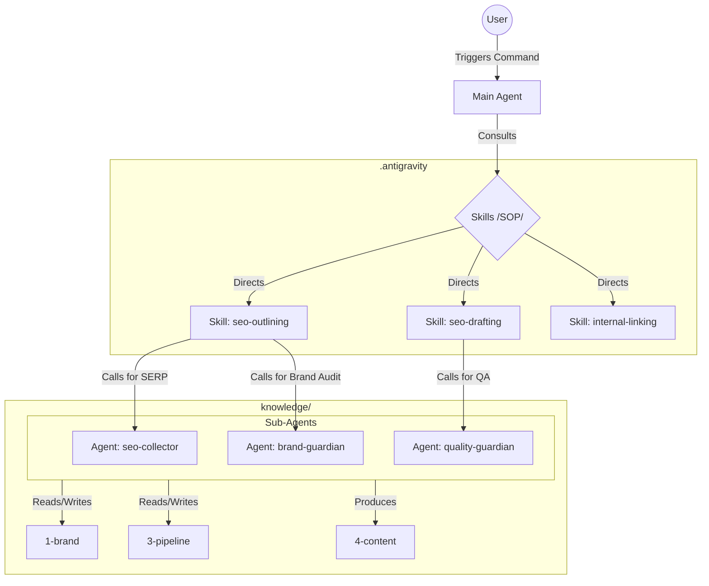

# 🧠 Project Knowledge Hub (agent.md)

Welcome to the SEO Writer Agent ecosystem. This file provides an overview of the architecture and how Sub-Agents collaborate to produce high-quality SEO content.

---

## 🎯 Project Goal
Build a scalable, data-driven SEO content production system that eliminates "AI-vibe" through rigorous research and multi-stage verification.

## 👥 Sub-Agent Ecosystem
- **SEO Collector** (`.antigravity/agents/seo-collector.md`): SERP research & Content Briefing.
- **Brand Guardian** (`.antigravity/agents/brand-guardian.md`): Identity & Style compliance.
- **Quality Guardian** (`.antigravity/agents/quality-guardian.md`): Independent QA & Fact-checking.
- **Research Agent** (`.antigravity/agents/research-agent.md`): Knowledge Base building.

## 🗺️ Relationship Map

## 🔄 Content Pipeline
The production process is split across two skills:
1. **Discovery:** `/setup` to build KB.
2. **Strategy:** `/cluster` to map topics. `/keyword-plan` to pick next articles.
3. **Outlining:** `/outlining` — `.antigravity/skills/seo-outlining/SKILL.md`
4. **Drafting:** `/drafting` or `/write` — `.antigravity/skills/seo-drafting/SKILL.md`

## 🗂️ Data Hierarchy
- **`.antigravity/`**: The system (skills, agents, internal templates).
- **`knowledge/`**: The strategic brain (Brand, Market, Pipeline, Content).

## 🛠️ Key Utilities
- **Internal Linking:** Use `/link` to backfill internal links from existing articles.
- **Skill Center:** Check `.antigravity/skills/` for specialized capabilities.
