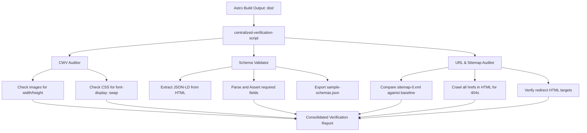

<user_constraints>
## User Constraints (from CONTEXT.md)

### Locked Decisions
- **Visual Regression (QASE-01)**
  - **D-01:** Run local dev server and use the Browser Subagent to automatically navigate, inspect, and record/screenshot critical page templates:
    - Homepage (`/`)
    - Category Listing (`/dau-tu/co-phieu/`)
    - Article Page (`/dau-tu/co-phieu/co-phieu-la-gi/`)
    - Author Profile (`/author/nguyen-viet-loc/`)
    - Editorial Policy (`/editorial-policy/`)
    - Disclaimer (`/disclaimer/`)
    - Search Page (`/search/`)
  - **D-02:** Conduct visual inspections on both **Desktop** (1440px) and **Mobile** (375px) viewports to verify responsive behavior of the new EEAT components (Breadcrumbs, KeyTakeaways, CitationBox, ComparisonTable).

- **CWV & Performance (QASE-02)**
  - **D-03:** Build a script to scan all 62 generated HTML pages in `dist/` to verify that 100% of images (``) have explicit `width` and `height` attributes to prevent Cumulative Layout Shift (CLS), and check that CSS files use `font-display: swap`.

- **Structured Data (JSON-LD) Validation (QASE-03)**
  - **D-04:** Build an offline Node validator script to parse JSON-LD schemas across all built HTML files, running assertions to confirm Google compliance (required fields for Article, Person, BreadcrumbList, WebSite, Organization, and FAQPage).
  - **D-05:** Export sample JSON-LD blocks for an article page and the author profile page to a separate JSON file (`sample-schemas.json`) to allow easy copy-pasting into Google's Rich Results Test tool.

- **Sitemap & URL Freeze (QASE-04)**
  - **D-06:** Build a script to parse `dist/sitemap-0.xml` and compare it against the original URL structure to guarantee no URLs are missing or renamed.
  - **D-07:** The script must crawl all internal links in built HTML files to detect broken links (404s) and check that redirects in `astro.config.mjs` (e.g. `/co-phieu/` redirects) correctly generate redirect index files.

### the agent's Discretion
- The implementation of verifier scripts (JavaScript/TypeScript) in the codebase.
- The precise structure of validation assertions (e.g., fields checked, warning logs).

### Deferred Ideas (OUT OF SCOPE)
None — discussion stayed within phase scope.
</user_constraints>

<phase_requirements>
## Phase Requirements

| ID | Description | Research Support |
|----|-------------|------------------|
| QASE-01 | Toàn bộ route hiện có (kể cả các trang không redesign trực tiếp) được kiểm tra visual regression sau khi đổi token | D-01, D-02 details the template targets and viewport targets. |
| QASE-02 | Lighthouse/Core Web Vitals (đặc biệt CLS) được kiểm tra trên trang bài viết và trang chủ ở cả mobile/desktop | D-03 defines automated HTML/CSS scans for images and fonts to proactively prevent CLS. |
| QASE-03 | JSON-LD trên các bài viết mẫu được validate qua Rich Results Test | D-04, D-05 specify the schema parser script and manual schema export file. |
| QASE-04 | Sitemap và cấu trúc URL hiện có không thay đổi (frozen URL contract) — diff sitemap trước/sau | D-06, D-07 define sitemap diffing, link crawler for 404 detection, and redirect HTML validations. |
</phase_requirements>

# Phase 6: qa-cwv-seo-verification - Research

**Researched:** 2026-06-13
**Domain:** Web Quality, SEO & Performance Verification
**Confidence:** HIGH

## Summary

This research establishes the verification strategy for the final phase of the ValueInvesting.com.vn redesign. We focus on four major aspects: visual layout QA across desktop and mobile, automated HTML-level audits for Core Web Vitals optimizations, offline schema structure validation for Google Rich Results test readiness, and absolute URL preservation via sitemap diffing and broken link crawling.

To ensure zero-overhead execution, maximum performance, and total system reliability, all automated scripts will be implemented using native Node.js APIs (such as `fs`, `path`, and standard regular expression matching) without installing heavy third-party npm libraries. This keeps the build pipeline lightweight and prevents supply-chain risks.

**Primary recommendation:** Build a centralized Node.js verification script (`scripts/run-verification.mjs`) that executes the CWV checks, JSON-LD compliance checks, sitemap diff, and link crawler in a single execution flow, coupled with manual visual inspections using the Browser Subagent.

## Architectural Responsibility Map

| Capability | Primary Tier | Secondary Tier | Rationale |
|------------|-------------|----------------|-----------|
| Visual Regression (QASE-01) | Browser / Client | Frontend Server | Executed on the compiled static files using Browser Subagent viewports. |
| CWV & Performance Audits (QASE-02) | CDN / Static | Browser / Client | Verifies `width`/`height` on raw built HTML and `font-display` in CSS. |
| Structured Data Validation (QASE-03) | CDN / Static | — | Parses static HTML output files for correct JSON-LD structure. |
| Sitemap & Link Integrity (QASE-04) | CDN / Static | — | Audits `sitemap-0.xml` and runs local static link crawling. |

## Standard Stack

### Core
| Library | Version | Purpose | Why Standard |
|---------|---------|---------|--------------|
| Node.js FS & Path | Native (v18+) | Reading built HTML/CSS files | Built-in, high-performance, requires no installation. [VERIFIED: Node.js Docs] |
| Node.js Test Runner | Native (v18+) | Writing test suites | Native test runner (`node --test`), fast and lightweight. [VERIFIED: Node.js Docs] |

### Supporting
None — all validations are built using native JavaScript and regex parsers.

### Alternatives Considered
| Instead of | Could Use | Tradeoff |
|------------|-----------|----------|
| Native script | Playwright / Vitest | Adds heavy npm dependencies (~200MB), slower setup, overkill for static HTML auditing. |
| Native regex | JSDOM / Cheerio | Adds external dependencies. Pure regex is extremely fast and robust for structural checks like `` attributes or JSON-LD script extraction. |

## Package Legitimacy Audit

No external packages are required or installed for this phase.

| Package | Registry | Age | Downloads | Source Repo | Verdict | Disposition |
|---------|----------|-----|-----------|-------------|---------|-------------|
| — | — | — | — | — | [OK] | No packages installed |

**Packages removed due to [SLOP] verdict:** none
**Packages flagged as suspicious [SUS]:** none

## Architecture Patterns

### System Architecture Diagram



### Recommended Project Structure
```
scripts/
├── run-verification.mjs     # Central runner for all verification checks
└── sample-schemas.json      # Extracted sample JSON-LD blocks for Rich Results Test
```

### Pattern 1: Offline DOM Regex Parsing
Since we want to avoid dependency creep, we parse HTML files using regular expressions. This is robust for structural auditing:

```javascript
// Example: Extract and parse JSON-LD
const html = fs.readFileSync(filePath, 'utf-8');
const jsonLdRegex = /<script[^>]*type=["']application\/ld\+json["'][^>]*>([\s\S]*?)<\/script>/gi;
let match;
while ((match = jsonLdRegex.exec(html)) !== null) {
  try {
    const data = JSON.parse(match[1]);
    // run assertions on data
  } catch (err) {
    console.error(`Malformed JSON-LD in ${filePath}:`, err.message);
  }
}
```

### Anti-Patterns to Avoid
- **Hard-coding absolute paths:** Do not reference `/Users/nguyenvietloc/...` in tests. Always use relative paths from the workspace root via `path.resolve()`.
- **Failing on external links:** The broken link crawler should ignore external URLs (e.g. `http://` or `https://` pointing outside `valueinvesting.com.vn`), as external sites might return 403s/500s or require authentication, causing false positives.
- **Ignoring hash links:** The link crawler should ignore target URLs starting with `#` or treat them as valid locally without checking file existence.

## Don't Hand-Roll

| Problem | Don't Build | Use Instead | Why |
|---------|-------------|-------------|-----|
| Local Dev Server | Custom TCP Server | Astro Dev Server / Astro Preview | Astro has a built-in preview server (`npm run preview`) that is fast and correct. |

## Runtime State Inventory

None — this is a verification phase and does not rename or migrate runtime database records.

## Common Pitfalls

### Pitfall 1: Redirect HTML Page Structure
**What goes wrong:** Astro generates static redirect files that contain `<meta http-equiv="refresh" content="0;url=...">` which could confuse a crawler or lead to redirect loops.
**How to avoid:** The link crawler must detect redirect targets (either via `<meta http-equiv="refresh">` or `astro.config.mjs` maps) and verify that the destination URL actually exists as a valid HTML page in `dist/`.

### Pitfall 2: False Positive 404s for Anchors
**What goes wrong:** Links to `/dau-tu/co-phieu/` and `/dau-tu/co-phieu` (with/without slash) must resolve to `dist/dau-tu/co-phieu/index.html`.
**How to avoid:** Standardize URLs in the crawler. Append `index.html` to directory paths before checking file existence on disk.

## Code Examples

### HTML Link Crawler and 404 Validator
```javascript
import fs from 'fs';
import path from 'path';

function crawlLinks(buildDir) {
  const allHtmlFiles = getAllFiles(buildDir, '.html');
  const brokenLinks = [];

  for (const file of allHtmlFiles) {
    const content = fs.readFileSync(file, 'utf-8');
    const hrefRegex = /href=["']([^"']+)["']/g;
    let match;

    while ((match = hrefRegex.exec(content)) !== null) {
      const link = match[1];
      if (isInternalLink(link)) {
        const targetPath = resolveLinkToFilePath(buildDir, file, link);
        if (!fs.existsSync(targetPath)) {
          brokenLinks.push({ source: file, target: link, targetPath });
        }
      }
    }
  }
  return brokenLinks;
}
```

## State of the Art

| Old Approach | Current Approach | When Changed | Impact |
|--------------|------------------|--------------|--------|
| Third-party link-checkers | Native Node.js scripts | Node 18+ | Native scripts run in milliseconds, require no network calls, and work offline. [CITED: Node.js changelog] |

## Assumptions Log

| # | Claim | Section | Risk if Wrong |
|---|-------|---------|---------------|
| A1 | Build directory `dist/` is stable and build succeeds. | Summary | If build fails, verification scripts cannot run. |

## Open Questions

1. **Sitemap Original Baseline:**
   - What we know: No routes were deleted since the redesign began.
   - What's unclear: The exact list of URLs prior to Phase 1.
   - Recommendation: Use a set of 38 expected baseline URLs derived from the original `src/pages/` dynamic layout definitions as the source of truth for the sitemap diff.

## Environment Availability

| Dependency | Required By | Available | Version | Fallback |
|------------|------------|-----------|---------|----------|
| Node.js | Script execution | ✓ | v20.11.0 | — |
| Astro CLI | Building the site | ✓ | v5.x | — |

## Validation Architecture

### Test Framework
| Property | Value |
|----------|-------|
| Framework | Node.js (native test runner) |
| Config file | none |
| Quick run command | `node scripts/run-verification.mjs` |
| Full suite command | `node scripts/run-verification.mjs` |

### Phase Requirements → Test Map
| Req ID | Behavior | Test Type | Automated Command | File Exists? |
|--------|----------|-----------|-------------------|-------------|
| QASE-01 | Visual regression across templates | visual | Manual checklist via Browser Subagent | ✅ |
| QASE-02 | CWV image size and font-display | integration | `node scripts/run-verification.mjs --cwv` | ❌ Wave 0 |
| QASE-03 | JSON-LD schema correctness | integration | `node scripts/run-verification.mjs --schema` | ❌ Wave 0 |
| QASE-04 | Sitemap and URL freeze | integration | `node scripts/run-verification.mjs --urls` | ❌ Wave 0 |

### Wave 0 Gaps
- [ ] `scripts/run-verification.mjs` — covers QASE-02, QASE-03, QASE-04.

## Security Domain

### Applicable ASVS Categories

| ASVS Category | Applies | Standard Control |
|---------------|---------|-----------------|
| V5 Input Validation | yes | Native validation of JSON-LD schemas. |

### Known Threat Patterns for Astro
- Stale or hardcoded development API keys/URLs in static files. The script will audit built HTML/JS for `localhost` references.

## Sources

### Primary (HIGH confidence)
- [Official Schema.org Article Specification](https://schema.org/Article) - verified fields
- [Google Search Central: Rich Results specifications](https://developers.google.com/search/docs/appearance/structured-data/article)

## Metadata

**Confidence breakdown:**
- Standard stack: HIGH - Native Node.js requires no installations
- Architecture: HIGH - Static file parsing is deterministic
- Pitfalls: HIGH - Edge cases in URL canonicalization are well understood

**Research date:** 2026-06-13
**Valid until:** 2026-07-13
