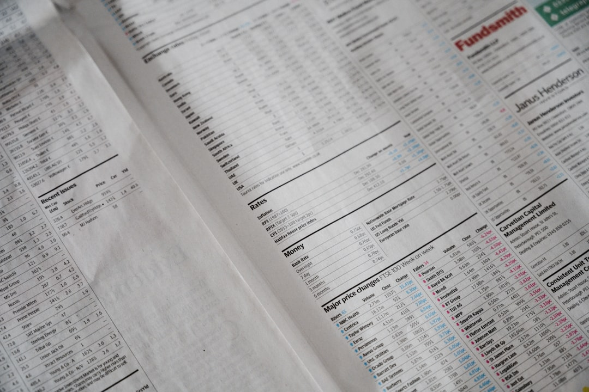

Khi quyết định mua một căn nhà, bạn chắc chắn sẽ muốn kiểm tra xem chủ nhà có đang mang sổ đỏ đi thế chấp ngân hàng hay không. Đối với việc mua cổ phiếu cũng vậy, bạn không thể bỏ qua bức tranh tài sản và nợ nần của công ty. **[Value Investing](/)** sẽ hướng dẫn bạn cách hiểu bảng cân đối kế toán một cách trực quan, giúp bạn nhìn thấu sức mạnh tài chính thực tế của doanh nghiệp.

## Bảng cân đối kế toán là gì? Bản chất của phương trình kế toán

Bảng cân đối kế toán là một báo cáo tài chính tổng hợp phản ánh toàn bộ giá trị tài sản và nguồn hình thành tài sản của công ty tại một thời điểm cụ thể. Thời điểm này thường là ngày cuối cùng của quý hoặc ngày cuối cùng của năm tài chính.

Báo cáo này hoạt động giống như một bức ảnh chụp nhanh tĩnh. Nó cho bạn biết chính xác doanh nghiệp đang có trong tay những gì và nợ những ai vào đúng ngày lập báo cáo.

Nguyên tắc bất di bất dịch của bảng này là hai vế luôn luôn bằng nhau. Tổng tài sản luôn bằng Tổng nợ phải trả cộng với Vốn chủ sở hữu.

## Ví dụ đời thường về tài sản và nguồn vốn khi mua nhà

Để hiểu sâu phương trình này, bạn hãy liên tưởng đến việc một gia đình trẻ mua căn hộ chung cư trị giá 3 tỷ đồng.

Gia đình này tích lũy được 1 tỷ đồng tiền tiết kiệm của bản thân. Họ quyết định vay ngân hàng thêm 2 tỷ đồng để đủ tiền thanh toán cho chủ đầu tư.

Trong trường hợp này, căn hộ chung cư 3 tỷ đồng chính là Tổng tài sản. Khoản nợ ngân hàng 2 tỷ đồng là Nợ phải trả, còn 1 tỷ đồng tiền tích lũy là Vốn chủ sở hữu.

Nếu giá nhà thị trường tăng lên 3.5 tỷ đồng, phần vốn của gia đình sẽ tăng lên 1.5 tỷ đồng. Nhưng nếu thị trường đóng băng và công việc gặp trục trặc, áp lực trả nợ 2 tỷ đồng sẽ đè nặng mỗi tháng.

## Cấu trúc chi tiết phần Tài sản (Ngắn hạn & Dài hạn)

Phần Tài sản phản ánh toàn bộ nguồn lực kinh tế mà doanh nghiệp kiểm soát và kỳ vọng mang lại lợi ích trong tương lai. Tài sản được xếp theo thứ tự tính thanh khoản giảm dần.

* **Tài sản ngắn hạn**. Các tài sản có thể chuyển đổi thành tiền mặt trong vòng 12 tháng hoặc một chu kỳ kinh doanh bình thường. Bao gồm tiền mặt, các khoản đầu tư tài chính ngắn hạn, khoản phải thu khách hàng và hàng tồn kho.

* **Tài sản dài hạn**. Các tài sản phục vụ hoạt động sản xuất kinh doanh trong thời gian dài trên 1 năm. Thành phần chủ yếu gồm tài sản cố định như nhà xưởng máy móc, bất động sản đầu tư và các dự án xây dựng dở dang dài hạn.

Khi phân tích tài sản, một doanh nghiệp lành mạnh cần duy trì lượng tiền và tương đương tiền dồi dào. Lượng tiền này giúp công ty dễ dàng chớp lấy các cơ hội đầu tư giá rẻ khi thị trường suy thoái.

## Cấu trúc chi tiết phần Nguồn vốn (Nợ phải trả & Vốn chủ sở hữu)

Phần Nguồn vốn cho biết tiền mua tài sản đến từ đâu. Đây là nơi bạn soi xét mức độ an toàn tài chính và chính sách đòn bẩy của ban điều hành.

Nguồn vốn được cấu thành từ hai nguồn tài trợ chính với chi phí và mức độ rủi ro hoàn toàn khác biệt.

* **Nợ phải trả**. Nghĩa vụ nợ hiện tại phát sinh từ các giao dịch trong quá khứ mà công ty phải thanh toán. Bạn cần tách bạch rõ giữa nợ vay tài chính có chịu lãi suất ngân hàng và nợ chiếm dụng vốn không chịu lãi như phải trả người bán.

* **Vốn chủ sở hữu**. Nguồn vốn thuộc quyền sở hữu của các cổ đông công ty. Bao gồm vốn góp ban đầu của chủ sở hữu, thặng dư vốn cổ phần và lợi nhuận sau thuế chưa phân phối tích lũy qua các năm.

*Ảnh: Annie Spratt / Unsplash*

## 3 chỉ số then chốt bóc tách từ Bảng cân đối kế toán

Sau khi nắm cấu trúc các dòng tiền, bạn có thể tính toán nhanh 3 chỉ số then chốt. Các chỉ số này giúp định lượng mức độ vững chắc của cơ cấu nguồn vốn.

* **Tỷ lệ Nợ vay trên Vốn chủ sở hữu (D/E)**. Lấy tổng nợ vay có lãi chia cho vốn chủ sở hữu. Tỷ lệ này dưới 1.0 lần thường được coi là an toàn đối với các doanh nghiệp sản xuất và thương mại thông thường.

* **Tỷ số thanh toán hiện hành (Current Ratio)**. Lấy tài sản ngắn hạn chia cho nợ ngắn hạn. Chỉ số này lớn hơn 1.5 lần chứng minh công ty có đủ tài sản lưu động để thanh toán mọi khoản nợ sắp đến hạn.

* **Tỷ trọng Tiền mặt trên Tổng tài sản**. Đo lường tấm đệm thanh khoản của doanh nghiệp. Tỷ lệ tiền mặt cao giúp doanh nghiệp vững vàng vượt qua giai đoạn kinh tế biến động mạnh.

## Cách nhận diện doanh nghiệp có cơ cấu tài chính lành mạnh

Một doanh nghiệp có nền tảng vững vàng thường sở hữu những đặc điểm rất rõ trên bảng cân đối. Việc tìm kiếm các đặc điểm này sẽ giúp bạn lọc ra những cổ phiếu xứng đáng nắm giữ dài hạn.

Đầu tiên là cơ cấu nợ vay thấp và tiền mặt dồi dào. Doanh nghiệp không bị phụ thuộc vào tín dụng ngân hàng sẽ có toàn quyền tự quyết trong việc tái đầu tư mở rộng quy mô.

Kế tiếp là khoản mục người mua trả tiền trước ngắn hạn có giá trị lớn. Điều này chứng minh sản phẩm của công ty có sức hút mạnh mẽ khiến khách hàng sẵn sàng đặt cọc tiền trước nhiều tháng.

Cuối cùng là lợi nhuận sau thuế chưa phân phối tăng trưởng liên tục qua từng năm. Đây là minh chứng rõ ràng cho thấy doanh nghiệp liên tục tích lũy của cải thực cho cổ đông.

## Các thủ thuật làm đẹp số liệu cần cảnh giác

Để che giấu tình trạng kém hiệu quả, một số doanh nghiệp có thể sử dụng các nghiệp vụ kế toán tinh vi. Nhà đầu tư thông minh cần tinh ý nhận diện những dấu hiệu bất thường này.

Một chiêu thức phổ biến là chuyển dịch các khoản tiền mặt sang mục Phải thu ngắn hạn khác hoặc Tạm ứng cho các công ty liên quan. Tiền thực chất đã bị rút ra khỏi doanh nghiệp mà cổ đông không hay biết.

Thêm vào đó, việc hàng tồn kho tăng liên tục qua nhiều quý nhưng trích lập dự phòng giảm giá hàng tồn kho lại bằng không là dấu hiệu của việc chậm ghi nhận chi phí để thổi phồng lợi nhuận.

## Làm chủ bảng cân đối để đầu tư vững tâm

Hiểu và làm chủ bảng cân đối kế toán là chìa khóa để bạn định lượng [giá trị nội tại](/phan-tich/co-ban/gia-tri-noi-tai-cua-co-phieu/) và xác định mức định giá theo [chỉ số P/B](/phan-tich/co-ban/pb-la-gi/). Một bảng cân đối vững chắc là tấm đệm đỡ giá an toàn nhất cho cổ phiếu trong các chu kỳ suy thoái.

Hãy kết hợp tài liệu này với bài viết [cách phân tích báo cáo tài chính](/phan-tich/co-ban/cach-phan-tich-bao-cao-tai-chinh/) để có góc nhìn đa chiều về hiệu quả hoạt động của doanh nghiệp bạn đang quan tâm.

