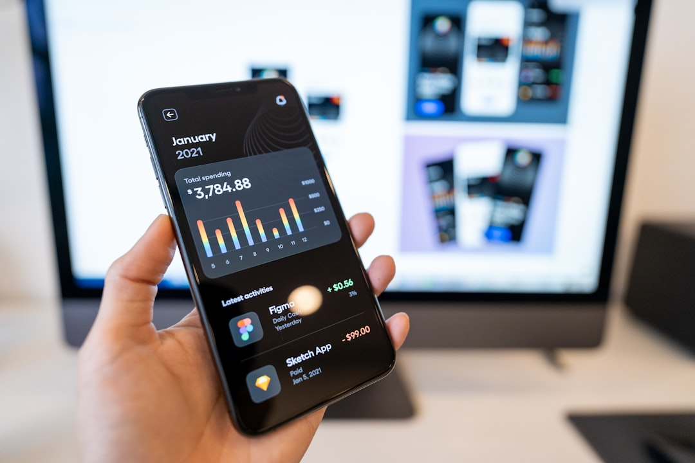

Nhiều người nghĩ đầu tư chứng khoán là một cái gì đó rất cao siêu, chỉ dành cho các chuyên gia tài chính hoặc những người có nhiều tiền. Sự thật là, bất kỳ ai cũng có thể bắt đầu tích lũy tài sản từ thị trường này nếu đi đúng lộ trình bài bản. Trong bài viết này, **[Value Investing](/)** sẽ hướng dẫn bạn cách đầu tư chứng khoán thực chiến từ con số 0, giúp bạn tự tin thực hiện giao dịch đầu tiên mà không sợ bị quá tải thông tin.

## Bản chất của đầu tư chứng khoán là gì?

Hãy thử nghĩ thế này. Bạn và hai người bạn thân cùng góp vốn mở một tiệm trà sữa nhỏ tại quận 1. Tổng số vốn ban đầu của cửa hàng là 100 triệu đồng. Bạn đóng góp 20 triệu đồng, tương ứng sở hữu 20% cổ phần của tiệm trà sữa đó.

Khi tiệm trà sữa kinh doanh có lời, bạn sẽ được chia 20% phần lợi nhuận tương ứng. Số tiền lời được chia này trong chứng khoán gọi là cổ tức. Nếu tiệm làm ăn ngày càng phát đạt, thương hiệu trà sữa của bạn tăng giá trị lên gấp đôi. Khi đó, phần vốn góp 20% của bạn có thể bán lại với giá 40 triệu đồng.

Đầu tư chứng khoán trên thị trường cũng hoạt động theo nguyên lý tương tự như vậy. Thay vì góp vốn mở tiệm trà sữa nhỏ, bạn mua **[cổ phiếu](/dau-tu/co-phieu/co-phieu-la-gi/)** của các doanh nghiệp khổng lồ đã niêm yết. Việc sở hữu cổ phiếu đồng nghĩa với việc bạn trở thành cổ đông của doanh nghiệp. Bạn sẽ được hưởng lợi ích từ sự tăng trưởng của doanh nghiệp đó trong dài hạn.

## Hướng dẫn đầu tư chứng khoán: Lộ trình 5 bước cho người mới

Để bắt đầu tham gia thị trường một cách an toàn, bạn nên thực hiện theo lộ trình 5 bước dưới đây. Quy trình chi tiết này giúp bạn từng bước đi từ tìm hiểu lý thuyết đến khi tự tay đặt lệnh mua thành công mà không bỡ ngỡ.

### Bước 1: Trang bị kiến thức nền tảng

Trước khi nạp tiền mua cổ phiếu, bạn cần dành thời gian làm quen với các khái niệm căn bản nhất. Hãy tìm hiểu bảng điện tử chứng khoán, các loại lệnh giao dịch và quy định thời gian. Thị trường chứng khoán Việt Nam mở cửa giao dịch từ thứ Hai đến thứ Sáu hàng tuần.

Khung giờ hoạt động cụ thể bắt đầu từ 9:00 đến 11:30 và từ 13:00 đến 15:00. Bạn cũng cần làm quen với chu kỳ thanh toán T+2 theo quy chế của UBCKNN. Cổ phiếu bạn mua sẽ về tài khoản vào chiều ngày làm việc thứ hai sau ngày giao dịch.

Hiểu rõ những quy định này giúp bạn chủ động quản lý dòng tiền giao dịch. Điều này tránh cho bạn những nhầm lẫn đáng tiếc trong những ngày đầu tham gia thị trường. Ngoài ra, nếu không có thời gian tự phân tích cổ phiếu, bạn nên tìm hiểu thêm **[cách đầu tư chứng chỉ quỹ](/dau-tu/etf/cach-dau-tu-chung-chi-quy/)** mở để giảm thiểu rủi ro.

### Bước 2: Chuẩn bị vốn đầu tư

Một trong những hiểu lầm phổ biến nhất của người mới là cần số tiền lớn để đầu tư. Sự thật là bạn có thể bắt đầu giao dịch với số vốn rất nhỏ. Các sàn giao dịch lớn tại Việt Nam quy định lô giao dịch tối thiểu là 100 cổ phiếu.

Nếu bạn mua một cổ phiếu có thị giá khoảng 15.000 đồng, bạn chỉ cần 1,5 triệu đồng. Bạn có thể xem thêm bài viết [đầu tư chứng khoán cần bao nhiêu tiền](/dau-tu/co-phieu/dau-tu-chung-khoan-can-bao-nhieu-tien/) để tính toán chi tiết hơn. Việc tìm hiểu **[cách đầu tư cổ phiếu](/dau-tu/co-phieu/cach-dau-tu-co-phieu/)** thực tế cũng giúp bạn tối ưu hóa lợi nhuận. Số vốn nhỏ này giúp bạn trải nghiệm cảm giác giao dịch thực tế mà không lo lắng về rủi ro.

Hãy coi khoản vốn ban đầu này như học phí để bạn tích lũy kinh nghiệm thực tế. Khi đã hiểu rõ cách vận hành của thị trường, bạn có thể nâng dần số tiền đầu tư.

### Bước 3: Mở tài khoản chứng khoán

Sau khi đã có kiến thức và vốn, bạn cần mở một tài khoản để tiến hành giao dịch. Bạn có thể dễ dàng mở tài khoản trực tuyến hoàn toàn miễn phí tại các công ty uy tín. Các đơn vị được hàng triệu nhà đầu tư lựa chọn gồm TCBS, VPS hay SSI.

Chỉ cần chuẩn bị căn cước công dân và một chiếc điện thoại thông minh có camera. Công nghệ xác thực danh tính trực tuyến eKYC sẽ giúp bạn hoàn tất thủ tục trong 5 phút. Hãy xem bài viết [cách mở tài khoản chứng khoán](/dau-tu/co-phieu/cach-mo-tai-khoan-chung-khoan/) để xem hướng dẫn chi tiết từng bước.

*Ảnh: Tran Mau Tri Tam ✪ / Unsplash*

Sau khi tài khoản được kích hoạt, bạn tiến hành chuyển khoản tiền vào để bắt đầu mua bán. Mọi thông tin tài khoản và số dư tiền gửi sẽ được bảo mật tuyệt đối.

### Bước 4: Lựa chọn cổ phiếu tốt

Việc chọn đúng cổ phiếu quyết định phần lớn kết quả đầu tư dài hạn của bạn. Đối với F0, phương án an toàn nhất là tập trung vào nhóm cổ phiếu VN30. Đây là những doanh nghiệp hàng đầu có nền tảng tài chính lành mạnh và minh bạch.

Bạn nên ưu tiên các công ty có doanh thu tăng trưởng đều đặn qua các năm. Hãy đọc thêm bài viết [cách chọn cổ phiếu tốt](/dau-tu/co-phieu/cach-chon-co-phieu-tot/) để hiểu rõ các chỉ số P/E hay ROE. Tuyệt đối tránh xa các cổ phiếu rác được quảng cáo tăng giá nhanh trên mạng.

Những cổ phiếu đầu cơ này mang lại rủi ro mất trắng rất lớn cho người thiếu kinh nghiệm. Tích lũy các doanh nghiệp uy tín giúp bạn ngủ ngon hơn khi thị trường biến động.

### Bước 5: Đặt lệnh mua và theo dõi

Bước cuối cùng là đăng nhập vào ứng dụng giao dịch để thực hiện đặt lệnh. Bạn có thể tự học **[chơi chứng khoán trên điện thoại](/dau-tu/co-phieu/cach-choi-chung-khoan-tren-dien-thoai/)** để bắt đầu giao dịch một cách dễ dàng. Nhập mã cổ phiếu, số lượng cần mua và mức giá cụ thể vào hệ thống.

Sau khi lệnh khớp thành công, bạn chỉ cần theo dõi biến động định kỳ của doanh nghiệp. Đừng nhìn bảng điện liên tục trong ngày nếu bạn xác định đầu tư dài hạn. Biến động ngắn hạn của giá cổ phiếu phản ánh tâm lý đám đông nhiều hơn là giá trị.

Hãy tập trung đánh giá kết quả hoạt động kinh doanh của doanh nghiệp theo từng quý. Việc này giúp bạn đưa ra quyết định giữ hay bán cổ phiếu một cách sáng suốt.

## 3 Nguyên tắc đầu tư chứng khoán cho người mới để bảo vệ vốn

Thị trường chứng khoán luôn đi kèm với những biến động khó lường trước. Để tồn tại lâu dài, bạn cần thuộc lòng 3 nguyên tắc quản trị rủi ro dưới đây.

Một là, hãy bắt đầu trải nghiệm thị trường bằng số vốn thật nhỏ. Hãy coi số tiền 1 hay 2 triệu đồng đầu tiên này là công cụ học tập. Việc này giúp bạn rèn luyện tâm lý trước những nhịp tăng giảm của bảng điện tử.

Hai là, không bao giờ bỏ tất cả số tiền của bạn vào một mã cổ phiếu. Hãy đa dạng hóa bằng cách chia vốn vào 3 đến 5 doanh nghiệp thuộc các ngành khác nhau. Điều này giúp giảm thiểu thiệt hại nếu một trong các doanh nghiệp gặp sự cố bất ngờ.

*Ảnh: Towfiqu barbhuiya / Unsplash*

Ba là, tuyệt đối không sử dụng đòn bẩy tài chính margin khi chưa có kinh nghiệm. Margin giống như một con dao hai lưỡi có thể khuếch đại khoản lỗ của bạn chỉ trong vài phiên. Bạn có thể đọc bài phân tích về [rủi ro đầu tư chứng khoán](/dau-tu/co-phieu/rui-ro-dau-tu-chung-khoan/) để hiểu sâu hơn về điều này. Tuân thủ kỷ luật cắt lỗ ở mức 7% đến 8% để bảo vệ an toàn cho tài khoản.

Hãy nhớ rằng, giữ được tiền luôn là điều kiện tiên quyết trước khi nghĩ đến việc kiếm tiền. Việc tích lũy thêm các **[kinh nghiệm chơi chứng khoán](/dau-tu/co-phieu/kinh-nghiem-choi-chung-khoan/)** thực chiến sẽ giúp bạn ngày một vững vàng hơn. Một nhà đầu tư kiên nhẫn và có kỷ luật sẽ luôn tìm thấy cơ hội bền vững trên thị trường. Bước tiếp theo bạn có thể làm ngay là chuẩn bị một số vốn nhỏ và mở thử tài khoản trực tuyến để trải nghiệm thực tế.
