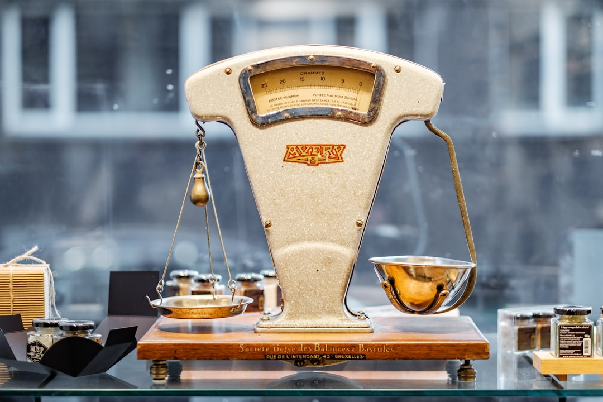

Bạn có một khoản tiền nhàn rỗi, gửi tiết kiệm thì lãi suất ngân hàng cứ giảm dần qua từng năm. Nghe nói đầu tư trái phiếu lãi cao hơn, nhưng không biết bắt đầu từ đâu và mua ở đâu mới đúng. Bài viết này từ **[Value Investing](/)** sẽ chỉ cho bạn cách đầu tư trái phiếu theo 3 cách phổ biến nhất tại Việt Nam, kèm các bước thực hiện cụ thể.

## Trái phiếu là gì, và khác gửi tiết kiệm thế nào?

[Trái phiếu](/dau-tu/trai-phieu/trai-phieu-la-gi/) là một loại giấy ghi nợ. Khi bạn mua trái phiếu, bạn đang cho tổ chức phát hành vay tiền theo kỳ hạn và lãi suất đã công bố trước.

Hãy thử nghĩ thế này. Quán cà phê gần nhà bạn cần vốn để mở thêm chi nhánh, nên ngỏ ý vay 100 triệu đồng từ khách quen, hẹn 1 năm sau trả lại 110 triệu. Đó chính là bản chất của một trái phiếu, chỉ khác là quy mô và bên phát hành lớn hơn rất nhiều.

*Ảnh: Precondo CA / Unsplash*

So với gửi tiết kiệm, điểm khác biệt quan trọng nhất là bảo hiểm. Tiền gửi tiết kiệm được bảo hiểm tiền gửi đến một hạn mức nhất định. Trái phiếu không có cơ chế bảo hiểm này, đổi lại lãi suất thường cao hơn lãi suất tiết kiệm cùng kỳ hạn.

## 3 cách đầu tư trái phiếu phổ biến tại Việt Nam

Cùng một loại tài sản, nhưng cách bạn tiếp cận trái phiếu sẽ quyết định vốn cần có và mức rủi ro phải chấp nhận. Dưới đây là 3 cách phổ biến nhất.

| Cách đầu tư | Vốn tối thiểu | Rủi ro | Phù hợp với ai |
| --- | --- | --- | --- |
| Mua sơ cấp từ tổ chức phát hành | Vài trăm triệu - vài tỷ đồng | Cao nếu tổ chức phát hành yếu | Nhà đầu tư chuyên nghiệp, vốn lớn |
| Mua qua công ty chứng khoán (thứ cấp) | Vài triệu - vài chục triệu đồng | Trung bình, phụ thuộc trái phiếu cụ thể | Người có kinh nghiệm, muốn chọn trái phiếu riêng |
| Đầu tư qua quỹ trái phiếu | 1-2 triệu đồng | Thấp hơn nhờ đa dạng hóa | Người mới bắt đầu |

[Trái phiếu doanh nghiệp](/dau-tu/trai-phieu/trai-phieu-doanh-nghiep/) phát hành riêng lẻ thường có lợi suất 8,7-9,5% mỗi năm, cao hơn lãi suất tiết kiệm. Nhưng theo Luật Chứng khoán 2019, loại trái phiếu này chỉ bán cho nhà đầu tư chứng khoán chuyên nghiệp.

Để được công nhận là nhà đầu tư chuyên nghiệp, cá nhân cần nắm danh mục chứng khoán giá trị trên 2 tỷ đồng, hoặc có thu nhập chịu thuế trên 1 tỷ đồng mỗi năm. Phần lớn người mới chưa đáp ứng điều kiện này.

Với đa số người mới, lựa chọn thực tế hơn là mua trái phiếu niêm yết qua công ty chứng khoán, hoặc đầu tư qua chứng chỉ quỹ của các quỹ trái phiếu mở. Những quỹ này gom tiền của nhiều nhà đầu tư nhỏ để mua một danh mục trái phiếu đa dạng, giúp giảm rủi ro tập trung vào một bên phát hành.

*Ảnh: Markus Spiske / Unsplash*

## Các bước đầu tư trái phiếu qua quỹ và công ty chứng khoán

Nếu bạn chưa đủ điều kiện làm nhà đầu tư chuyên nghiệp, đây là cách bắt đầu thực tế nhất.

1. **Mở tài khoản chứng khoán**. Chọn công ty chứng khoán có phân phối trái phiếu niêm yết hoặc chứng chỉ quỹ trái phiếu.

2. **Tìm hiểu quỹ trái phiếu đang phân phối**. Xem NAV và lợi suất 12 tháng gần nhất của các quỹ như TCBF, SSIBF, VNDBF, BVBF.

3. **Nộp tiền và đặt lệnh mua**. Với 2 triệu đồng, bạn có thể mua chứng chỉ quỹ trái phiếu ngay trên app của công ty chứng khoán.

4. **Theo dõi NAV định kỳ**. Quỹ trái phiếu biến động chậm, bạn chỉ cần kiểm tra hàng tháng, không cần theo dõi hàng ngày như cổ phiếu.

5. **Bán lại khi cần tiền**. Chứng chỉ quỹ mở có thể bán lại cho công ty quản lý quỹ, còn trái phiếu niêm yết bán trên thị trường thứ cấp tại HNX hoặc HOSE.

## Rủi ro và tiêu chí chọn trái phiếu cần lưu ý

*Ảnh: Piret Ilver / Unsplash*

Nhiều người mới nghĩ trái phiếu an toàn tuyệt đối vì lãi suất cố định. Sự thật là rủi ro lớn nhất nằm ở khả năng trả nợ của bên phát hành, không phải biến động giá hàng ngày.

Ba loại rủi ro cần lưu ý:

- **Rủi ro tín dụng**. Tổ chức phát hành kinh doanh kém, không trả được gốc và lãi đúng hạn.

- **Rủi ro lãi suất**. Khi lãi suất thị trường tăng, giá trái phiếu cũ với lãi suất thấp hơn sẽ giảm nếu bạn muốn bán trước hạn.

- **Rủi ro thanh khoản**. Một số trái phiếu doanh nghiệp khó bán lại ngay khi cần tiền gấp.

Để giảm rủi ro, hãy ưu tiên trái phiếu có xếp hạng tín nhiệm cao, có tài sản đảm bảo, và được phân phối qua công ty chứng khoán uy tín. So với [cách đầu tư cổ phiếu](/dau-tu/co-phieu/cach-dau-tu-co-phieu/), trái phiếu có biến động giá thấp hơn, nhưng không có nghĩa là không có rủi ro mất gốc.

> **Lưu ý:** Đơn vị ngân hàng hoặc công ty chứng khoán phân phối trái phiếu không phải là bên bảo lãnh thanh toán. Trách nhiệm trả nợ vẫn thuộc về tổ chức phát hành.

Điểm quan trọng nhất khi bắt đầu là chọn đúng kênh phù hợp với số vốn và mức rủi ro bạn chấp nhận được, không phải chạy theo lợi suất cao nhất. Bước tiếp theo bạn có thể làm ngay là mở tài khoản chứng khoán và xem thử NAV của một vài quỹ trái phiếu trước khi quyết định xuống tiền.

---

*Nội dung trong bài chỉ mang tính chất tham khảo và giáo dục, không phải lời khuyên đầu tư cho một sản phẩm cụ thể. Trước khi đầu tư, bạn nên tìm hiểu kỹ bản cáo bạch và xếp hạng tín nhiệm của tổ chức phát hành.*
