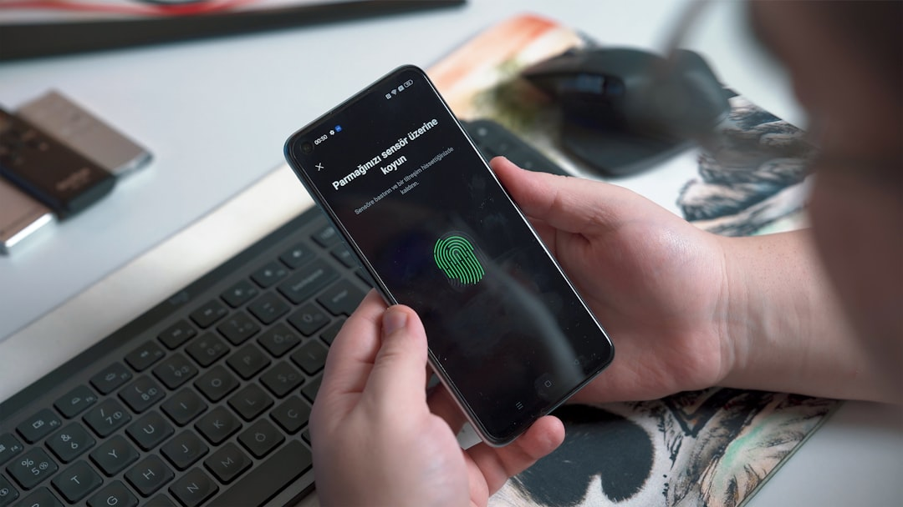

SSI là cái tên quen thuộc với nhà đầu tư ưu tiên sự an toàn và báo cáo phân tích chất lượng. Nhưng phí giao dịch của sàn này không rẻ. Bài hướng dẫn **cách mở tài khoản chứng khoán SSI** này từ **[Value Investing](/)** đi qua từng bước eKYC. Bạn sẽ biết cách chọn giữa VNeID và CCCD gắn chip.

Mở tài khoản SSI online chỉ mất vài phút và hoàn toàn miễn phí. Trước khi bắt đầu, bạn nên biết cần chuẩn bị những gì.

## Cần chuẩn bị gì trước khi mở tài khoản SSI?

Mở tài khoản SSI online miễn phí và không yêu cầu số dư tối thiểu. Bạn chỉ cần vài thứ cơ bản trước khi bắt đầu.

| Cần chuẩn bị | Chi tiết |
|---|---|
| Độ tuổi | Đủ 18 tuổi trở lên |
| Giấy tờ | Căn cước gắn chip còn hạn hoặc tài khoản VNeID mức 2 |
| Thiết bị | Điện thoại thông minh có camera |
| Ngân hàng | Số tài khoản ngân hàng chính chủ để liên kết |

Nên chuẩn bị sẵn số tài khoản ngân hàng đứng tên chính bạn. Bước liên kết ngân hàng sau này cần trùng khớp họ tên với tài khoản chứng khoán.

## Hướng dẫn mở tài khoản chứng khoán SSI online bằng eKYC

Toàn bộ quy trình thực hiện trên app iBoard hoặc website SSI, mất khoảng 3–5 phút. Bạn làm lần lượt các bước sau.

*Ảnh: Onur Binay / Unsplash*

* **Bước 1**. Tải app SSI iBoard hoặc vào website SSI, rồi chọn Mở tài khoản.

* **Bước 2**. Nhập thông tin cá nhân và chọn loại tài khoản cá nhân.

* **Bước 3**. Chọn cách xác thực eKYC bằng VNeID hoặc CCCD gắn chip (xem so sánh bên dưới).

* **Bước 4**. Chia sẻ thông tin định danh hoặc chụp hai mặt căn cước, sau đó xác thực khuôn mặt.

* **Bước 5**. Ký hợp đồng điện tử để kích hoạt tài khoản.

### Nên xác thực bằng VNeID hay CCCD gắn chip?

SSI cho bạn hai cách định danh, mỗi cách hợp với một nhóm người khác nhau. Bảng dưới đây giúp bạn chọn nhanh.

| Tiêu chí | VNeID | CCCD gắn chip |
|---|---|---|
| Yêu cầu | Tài khoản VNeID mức 2 | Căn cước gắn chip còn hạn |
| Thao tác | Đăng nhập VNeID, chia sẻ thông tin | Chụp hai mặt căn cước và quét khuôn mặt |
| Nên chọn khi | Đã kích hoạt VNeID mức 2 | Chưa dùng VNeID hoặc muốn cách quen thuộc |

Nếu bạn đã kích hoạt VNeID mức 2, cách này gọn và ít sai sót nhất. Còn chưa quen VNeID thì chụp căn cước gắn chip vẫn nhanh và phổ biến.

## Xác thực và kích hoạt tài khoản mất bao lâu?

Với hồ sơ hợp lệ, tài khoản thường được kích hoạt nhanh trong ngày làm việc. Một số trường hợp SSI có thể yêu cầu bổ sung giấy tờ để đối chiếu.

Bạn đăng nhập iBoard bằng số điện thoại hoặc số tài khoản chứng khoán. Việc cuối cùng là thiết lập mật khẩu và mã PIN đặt lệnh riêng.

## Các lỗi eKYC thường gặp và cách xử lý

Phần lớn trục trặc khi mở tài khoản đến từ khâu định danh. Bảng dưới đây liệt kê các lỗi phổ biến và cách khắc phục.

| Lỗi thường gặp | Nguyên nhân | Cách xử lý |
|---|---|---|
| Ảnh căn cước lóa, mờ | Chụp dưới đèn vàng hoặc dùng flash | Chụp nơi đủ sáng, tắt flash, giữ máy chắc tay |
| Giấy tờ hết hạn | Căn cước hoặc hộ chiếu quá hạn | Dùng giấy tờ tùy thân còn hạn |
| VNeID không chia sẻ được | Tài khoản chưa định danh mức 2 | Ra công an xã kích hoạt VNeID mức 2 trước |
| Sai thông tin cá nhân | Hệ thống đọc nhầm ký tự trên căn cước | Kiểm tra và sửa tay trước khi xác nhận |

Việc chụp căn cước bị lóa rất hay gặp. Nó giống như khi bạn chụp hóa đơn dưới đèn vàng ở quán cà phê rồi về nhìn lại không rõ chữ. Chỉ cần đổi sang chỗ sáng trắng là ảnh nét ngay.

## Sau khi mở xong: liên kết ngân hàng và đặt lệnh đầu tiên

Có tài khoản rồi không có nghĩa là mua được cổ phiếu ngay. Bạn cần thêm hai việc nữa.

Trước hết, liên kết tài khoản ngân hàng chính chủ rồi nạp tiền vào tài khoản chứng khoán. Chuyển khoản nhớ ghi đúng nội dung theo cú pháp SSI cung cấp.

Sau đó bạn có thể đặt lệnh mua đầu tiên trên iBoard. Lưu ý tiền bị phong tỏa ngay khi đặt lệnh, và cổ phiếu về tài khoản theo chu kỳ T+2. Nếu cần nắm kỹ hơn quy trình chung, hãy đọc bài [cách mở tài khoản chứng khoán](/dau-tu/co-phieu/cach-mo-tai-khoan-chung-khoan/).

## Mở tài khoản SSI có mất phí không? Lưu ý về phí giao dịch

Mở tài khoản tại SSI miễn phí và không có số dư tối thiểu. Đây là điểm cộng cho người mới muốn thử sức với số vốn nhỏ.

Tuy nhiên, phí giao dịch của SSI dao động 0.15%–0.25%, cao hơn nhóm sàn miễn phí. Đổi lại, bạn nhận được hệ thống ổn định và báo cáo phân tích chất lượng cao.

Nếu bạn giao dịch thường xuyên với vốn nhỏ, khoản phí này đáng cân nhắc. Bạn nên đọc kỹ [Review SSI Securities](/reviews/review-ssi-securities/) và bài [so sánh TCBS và SSI](/reviews/so-sanh-tcbs-vs-ssi/) trước khi quyết định gắn bó.

Mở tài khoản SSI rất nhanh. Nhưng giá trị dài hạn nằm ở việc bạn hiểu rõ mức phí cao đổi lấy điều gì. Bước tiếp theo bạn có thể làm ngay là tải app iBoard và chuẩn bị sẵn giấy tờ tùy thân. Trước khi giao dịch thật, hãy đọc [Review SSI Securities](/reviews/review-ssi-securities/) để biết sàn này có hợp với bạn không.

> **Miễn trừ trách nhiệm & Công khai tài trợ:** Bài viết mang tính hướng dẫn tham khảo, không phải lời khuyên đầu tư. Value Investing có thể nhận hoa hồng giới thiệu khi bạn mở tài khoản qua một số liên kết, nhưng điều này không làm thay đổi tính khách quan của nội dung.
