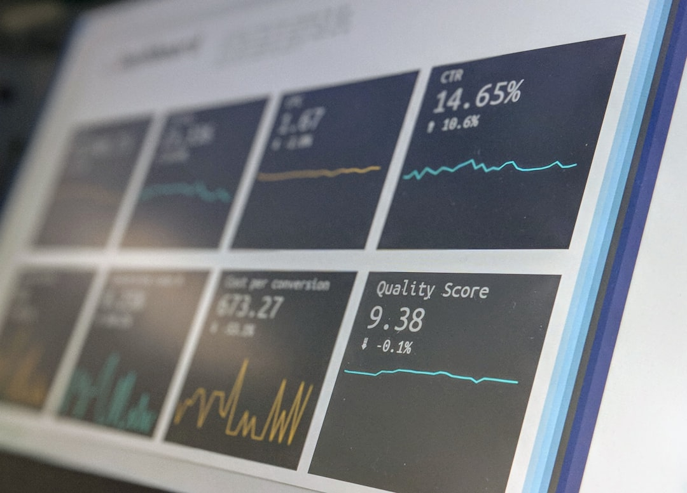

Sau khi đã nắm vững [cách đọc báo cáo tài chính](/phan-tich/co-ban/cach-doc-bao-cao-tai-chinh/) cơ bản, bước đi quyết định tiếp theo là liên kết các con số lại với nhau. Nhiều nhà đầu tư nhìn vào khoản lợi nhuận hàng trăm tỷ đồng mà không nhận ra doanh nghiệp đang gánh khối nợ khổng lồ. **[Value Investing](/)** sẽ hướng dẫn bạn cách phân tích báo cáo tài chính có hệ thống để bóc tách năng lực cạnh tranh thực sự của cổ phiếu.

## Phân tích báo cáo tài chính khác gì so với chỉ đọc báo cáo?

Đọc báo cáo tài chính giống như việc bạn nhìn vào các chỉ số huyết áp hay nhịp tim trên phiếu khám bệnh. Những con số này chỉ mang tính mô tả thực trạng.

Phân tích báo cáo tài chính là bước chẩn đoán chuyên sâu của bác sĩ. Bạn phải tìm hiểu nguyên nhân đằng sau các biến động đó và dự báo xu hướng tương lai.

Việc phân tích giúp bạn trả lời câu hỏi liệu doanh nghiệp có đang kinh doanh hiệu quả hay không. Nhờ đó, bạn sẽ tránh được việc mua phải các công ty có vỏ bọc hào nhoáng nhưng nội lực rỗng tuếch.

## Ví dụ đời thường về hiệu quả đồng vốn kinh doanh

Để hiểu rõ bản chất phân tích tài chính, bạn hãy quan sát câu chuyện của hai cửa hàng bách hóa ở cạnh nhau.

Cửa hàng A đạt doanh thu 1 tỷ đồng mỗi năm và lãi ra 100 triệu đồng. Cửa hàng B chỉ đạt doanh thu 500 triệu đồng nhưng cũng thu về lợi nhuận 100 triệu đồng.

Nếu chỉ nhìn vào con số lợi nhuận 100 triệu đồng, nhiều người sẽ cho rằng hai tiệm kinh doanh tốt ngang nhau. Tuy nhiên, cửa hàng B có biên lợi nhuận lên đến 20%, gấp đôi mức 10% của cửa hàng A.

Hơn nữa, nếu cửa hàng B chỉ cần số vốn 200 triệu đồng để vận hành, hiệu suất sinh lời trên vốn của họ vượt trội hoàn toàn. Đây chính là giá trị cốt lõi mà việc phân tích chỉ số mang lại cho bạn.

## 4 nhóm chỉ số vàng cần phân tích chi tiết

Để đánh giá toàn diện một doanh nghiệp, nhà đầu tư thường phân loại các chỉ số tài chính thành 4 trụ cột chính. Mỗi trụ cột đo lường một khía cạnh sức khỏe tài chính khác nhau.

* **Nhóm chỉ số sinh lời**. Phổ biến nhất là [ROE là gì](/phan-tich/co-ban/roe-la-gi/) và ROA. ROE đo lường một đồng vốn chủ sở hữu làm ra bao nhiêu đồng lợi nhuận sau thuế. Mức ROE trên 15% liên tục trong nhiều năm là dấu hiệu của một công ty tuyệt vời.

* **Nhóm chỉ số đòn bẩy tài chính**. Thể hiện qua tỷ lệ Nợ vay trên Vốn chủ sở hữu (D/E). Doanh nghiệp có tỷ lệ D/E quá cao sẽ chịu tổn thương nặng nề khi lãi suất ngân hàng tăng.

* **Nhóm chỉ số thanh khoản**. Đo lường khả năng trả các khoản nợ ngắn hạn bằng tài sản ngắn hạn (Current Ratio và Quick Ratio). Tỷ số thanh toán hiện hành nên duy trì trên 1.2 lần để đảm bảo an toàn.

* **Nhóm chỉ số hiệu quả hoạt động**. Vòng quay hàng tồn kho và số ngày thu tiền bình quân. Vòng quay hàng tồn kho càng nhanh chứng tỏ sản phẩm của công ty bán rất chạy trên thị trường.

*Ảnh: Stephen Dawson / Unsplash*

## Phương pháp phân tích DuPont: Bí quyết bóc tách ROE

Chỉ số ROE cao là điều ai cũng thích. Nhưng một doanh nghiệp có thể làm đẹp ROE bằng cách vay nợ ngập đầu thay vì nâng cao năng lực kinh doanh.

Mô hình phân tích DuPont giúp bạn phân tách ROE thành ba thành tố độc lập. Nhờ đó, bạn sẽ thấy rõ động lực thực sự thúc đẩy sự tăng trưởng của công ty.

* **Biên lợi nhuận ròng**. Đo lường khả năng kiểm soát chi phí và sức mạnh định giá sản phẩm của công ty.

* **Vòng quay tổng tài sản**. Đo lường mức độ hiệu quả trong việc sử dụng tài sản để tạo ra doanh thu.

* **Đòn bẩy tài chính**. Đo lường mức độ sử dụng nợ vay của doanh nghiệp.

Nếu một cổ phiếu có ROE tăng vọt nhờ biên lợi nhuận và vòng quay tài sản tăng, đó là tăng trưởng chất lượng. Ngược lại, nếu ROE tăng chỉ vì công ty tăng cường vay nợ, đó là rủi ro tiềm ẩn.

## Quy trình 3 bước so sánh ngang và so sánh dọc

Một con số tài chính đứng riêng lẻ sẽ không mang lại nhiều ý nghĩa. Bạn cần đặt con số đó vào các hệ quy chiếu so sánh cụ thể.

Kỹ thuật này giúp bạn định vị chính xác vị thế cạnh tranh của doanh nghiệp trong bức tranh tổng thể của toàn ngành. Hãy thực hiện tuần tự theo 3 bước sau.

* **Bước 1. Phân tích xu hướng lịch sử (So sánh dọc)**. Thu thập dữ liệu tài chính trong tối thiểu 3 đến 5 năm liên tiếp. Xem xét biên lợi nhuận và doanh thu đang trong xu hướng mở rộng hay thu hẹp.

* **Bước 2. So sánh với các đối thủ trực tiếp (So sánh ngang)**. Đặt các chỉ số của công ty cạnh các đối thủ lớn cùng ngành. Một doanh nghiệp đầu ngành thường sở hữu biên lợi nhuận và ROE vượt trội so với mức trung bình ngành.

* **Bước 3. Đánh giá chất lượng dòng tiền đi kèm**. So sánh tốc độ tăng trưởng của lợi nhuận với tốc độ tăng trưởng của dòng tiền thuần từ kinh doanh. Lợi nhuận cần được bảo chứng bằng dòng tiền mặt thực tế chảy về tài khoản.

## 3 sai lầm nguy hiểm khi phân tích báo cáo tài chính

Người mới thường dễ mắc phải những cái bẫy phân tích phổ biến khiến kết quả đầu tư không như mong đợi. Việc nhận biết sớm các sai lầm này sẽ giúp bạn giữ chặt vốn.

Sai lầm đầu tiên là so sánh chéo các chỉ số giữa hai ngành nghề hoàn toàn khác nhau. Ví dụ, bạn không thể so sánh biên lợi nhuận của một công ty công nghệ phần mềm với một nhà máy sản xuất thép.

Sai lầm thứ hai là chỉ nhìn vào lợi nhuận một quý duy nhất để kết luận cả tương lai. Một số doanh nghiệp có tính chu kỳ rất cao hoặc có khoản thu nhập bất thường do thanh lý tài sản.

Sai lầm thứ ba là bỏ qua phần Thuyết minh báo cáo tài chính. Thuyết minh là nơi ban lãnh đạo giải trình về các khoản nợ tiềm tàng, các giao dịch với bên liên quan và các vụ kiện tụng có thể ảnh hưởng lớn đến tương lai.

## Nâng cao năng lực chọn cổ phiếu của bạn

Nắm vững cách phân tích báo cáo tài chính là tấm khiên vững chắc nhất bảo vệ bạn trên thị trường chứng khoán. Bạn sẽ không còn bị lung lay bởi những lời rủ rê hay những phiên rung lắc nhất thời.

Hãy kết hợp phân tích tài chính với việc định giá qua [chỉ số P/E](/phan-tich/co-ban/pe-la-gi/) để nhận diện những [cổ phiếu tăng trưởng](/dau-tu/co-phieu/cach-nhan-biet-co-phieu-tiem-nang/) đang được thị trường định giá dưới giá trị thực.

