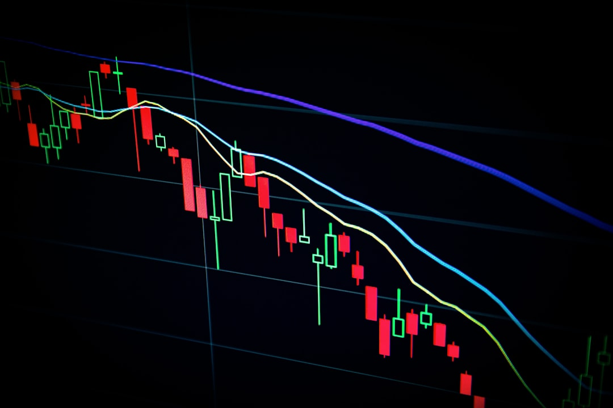

Sáng hôm sau mở app chứng khoán, tài khoản bạn đột nhiên có thêm cổ phiếu. Nhưng tổng giá trị vẫn y nguyên. **[Value Investing](/)** sẽ giải thích tại sao — và **chia tách cổ phiếu là gì** thực ra không phức tạp như bạn nghĩ.

## Chia tách cổ phiếu là gì?

Chia tách cổ phiếu (tiếng Anh: Stock Split) là nghiệp vụ doanh nghiệp tăng số lượng cổ phiếu lưu hành theo một tỷ lệ nhất định, đồng thời giảm mệnh giá tương ứng, mà không làm thay đổi vốn điều lệ hay vốn hóa thị trường.

Hình dung đơn giản nhất. Bạn có 1 tờ 500.000đ. Bạn ra ngân hàng đổi thành 5 tờ 100.000đ. Tổng số tiền vẫn là 500.000đ — chỉ có số tờ tăng lên và mệnh giá mỗi tờ giảm đi. Chia tách cổ phiếu hoạt động theo đúng nguyên lý đó.

**Ví dụ thực tế tại Việt Nam.** Hòa Phát (HPG) từng thực hiện chia cổ tức bằng cổ phiếu tỷ lệ 1:1 — nhà đầu tư giữ 100 cổ phiếu nhận thêm 100 cổ phiếu mới. Giá HPG trên sàn bị điều chỉnh giảm còn một nửa vào ngày giao dịch đầu tiên sau đó. Tổng giá trị tài khoản không thay đổi.

### Công thức tính giá và chỉ số sau khi tách

Khi tách theo tỷ lệ N:1 (mỗi 1 cổ phiếu cũ nhận N cổ phiếu mới):

**Giá mới = Giá cũ / N**

**EPS mới = EPS cũ / N**

**P/E sau tách = P/E trước tách** (vì cả giá và EPS cùng chia N)

Điều này có nghĩa là chia tách không làm cổ phiếu rẻ hay đắt hơn về mặt định giá — chỉ thay đổi về mặt đơn vị.

## Tại sao doanh nghiệp thực hiện chia tách cổ phiếu?

Có 3 lý do chính khiến doanh nghiệp quyết định chia tách.

**Giảm giá để tăng thanh khoản.** Khi giá cổ phiếu tăng quá cao, lệnh mua nhỏ lẻ bị hạn chế vì nhà đầu tư nhỏ không đủ tiền mua một lô chẵn 100 cổ phiếu. Apple năm 2020 tách tỷ lệ 4:1 — giá từ khoảng 500 USD xuống còn 125 USD — và khối lượng giao dịch tăng đột biến trong những tuần sau đó.

**Thu hút nhà đầu tư phổ thông.** Cổ phiếu giá thấp hơn tiếp cận được nhiều tệp nhà đầu tư hơn, đặc biệt là F0 mới tham gia thị trường với vốn nhỏ.

**Tạo tín hiệu tích cực tâm lý.** Doanh nghiệp chỉ chia tách khi tự tin giá cổ phiếu sẽ tiếp tục tăng trong tương lai — đây là tín hiệu ban lãnh đạo đang lạc quan về triển vọng kinh doanh.

## 3 hình thức chia tách phổ biến tại Việt Nam

Ở thị trường Việt Nam, "chia tách cổ phiếu" thường được thực hiện qua một trong ba hình thức dưới đây — mỗi hình thức có tác động khác nhau đến dòng tiền doanh nghiệp.

*Ảnh: Mathieu Stern / Unsplash*

| Hình thức | Dòng tiền vào DN | Ảnh hưởng EPS | Ảnh hưởng tỷ lệ sở hữu |
| :--- | :--- | :--- | :--- |
| **Chia cổ tức bằng cổ phiếu** | Không có | Giảm theo tỷ lệ | Không đổi |
| **Phát hành quyền mua cho CĐ hiện hữu** | Có (CĐ bỏ tiền mua) | Giảm | Giảm nếu không thực hiện quyền |
| **Phát hành riêng lẻ / ESOP** | Có (hoặc không, tùy điều kiện) | Giảm | Giảm |

Hình thức phổ biến nhất tại Việt Nam là **chia cổ tức bằng cổ phiếu** — doanh nghiệp không nhận thêm tiền, không thay đổi tỷ lệ sở hữu của bạn, chỉ tăng số lượng cổ phiếu và giảm giá tương ứng.

> **Lưu ý.** Chia cổ tức bằng cổ phiếu và phát hành thêm để tăng vốn là hai việc khác nhau hoàn toàn. Phát hành thêm có tiền vào doanh nghiệp và thường làm pha loãng tỷ lệ sở hữu của cổ đông hiện hữu nếu bạn không tham gia quyền mua.

## Chia tách cổ phiếu ảnh hưởng gì đến nhà đầu tư?

Điểm quan trọng nhất cần nắm. Chia tách **không làm bạn giàu thêm hay nghèo đi** — nhưng ảnh hưởng đến trải nghiệm đầu tư theo một số cách.

**Giá trị tài sản.** Không thay đổi ngay tại thời điểm tách.

**Thanh khoản.** Cải thiện — cổ phiếu giá thấp hơn dễ mua bán hơn, số lệnh giao dịch tăng lên.

**Chỉ số định giá.** P/E, P/B không thay đổi. EPS giảm theo tỷ lệ tách. Vốn hóa thị trường không đổi.

**Tâm lý thị trường.** Thường tích cực ngắn hạn. Lịch sử cho thấy nhiều cổ phiếu tăng giá trong 6–12 tháng sau khi chia tách — nhưng đây là kết quả của triển vọng kinh doanh tốt, không phải do bản thân hành động chia tách.

## Nhà đầu tư cần làm gì khi cổ phiếu đang giữ bị tách?

Câu trả lời ngắn gọn: **gần như không cần làm gì cả.**

Đây là 4 bước thực tế để bạn nắm rõ quy trình.

**Bước 1.** Đọc thông báo chính thức từ HNX hoặc HOSE về tỷ lệ tách và ngày chốt danh sách cổ đông (ngày đăng ký cuối cùng). Thông tin này được công bố công khai trên website của hai sàn và trong app của công ty chứng khoán.

**Bước 2.** Đảm bảo bạn đang nắm giữ cổ phiếu trước ngày giao dịch không hưởng quyền. Nếu bạn mua vào ngày này hoặc sau đó, bạn sẽ không được nhận quyền từ đợt chia tách.

**Bước 3.** Sau ngày giao dịch không hưởng quyền, số lượng cổ phiếu trong tài khoản sẽ tự động được cập nhật. Giá tham chiếu của cổ phiếu cũng sẽ tự động được điều chỉnh theo tỷ lệ tương ứng.

**Bước 4.** Kiểm tra lại số dư tài khoản và giá mới. Không cần đặt lệnh thêm hay thực hiện thao tác nào.

## Mua cổ phiếu trước hay sau khi tách?

Đây là câu hỏi mà nhiều nhà đầu tư mới thường thắc mắc. Câu trả lời trung thực là: không có quy tắc chắc chắn nào.

Thực tế là giá cổ phiếu sau khi chia tách thường đã phản ánh kỳ vọng của thị trường. Mua trước tách có thể bị đẩy giá cao bởi FOMO; mua sau tách giá đã điều chỉnh xuống nhưng kỳ vọng thị trường có thể đã được tiêu hóa.

Quyết định mua hay không dựa trên giá trị nội tại của doanh nghiệp — không phải dựa trên sự kiện chia tách.

---

Chia tách cổ phiếu là sự kiện tốt khi doanh nghiệp đang trên đà tăng trưởng và muốn mở rộng cơ sở cổ đông. Nhưng đừng mua cổ phiếu chỉ vì sắp tách — tín hiệu quan trọng hơn là doanh nghiệp đó đang kiếm được bao nhiêu tiền thực sự.

Danh mục của bạn đang có cổ phiếu nào giao dịch ở mức giá rất cao? Đó có thể là ứng viên tiếp theo cho một đợt chia tách — và giờ bạn đã biết điều gì sẽ xảy ra. Tìm hiểu thêm về cách đánh giá cổ phiếu tại [cách đầu tư cổ phiếu](/dau-tu/co-phieu/cach-dau-tu-co-phieu/).
