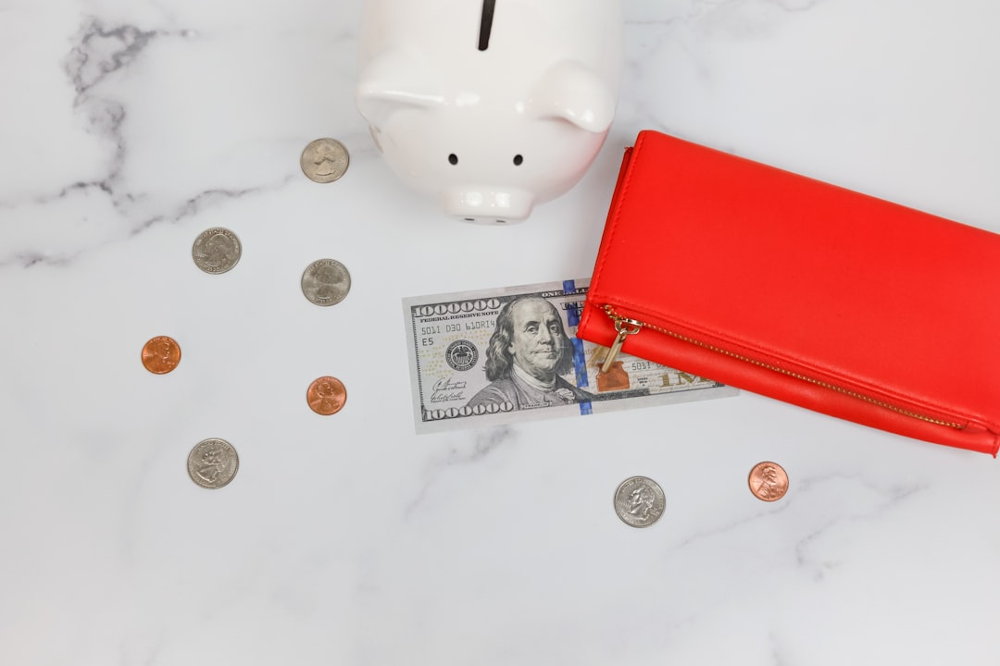

Lại suất tiết kiệm ngân hàng xuống thấp khiến nhiều bạn F0 sốt ruột tìm kênh đầu tư thay thế nhưng lại sợ rủi ro tự chơi chứng khoán. Mua chứng chỉ quỹ từ các quỹ đầu tư lớn ở Việt Nam là một giải pháp an toàn hơn. **[Value Investing](/)** sẽ tổng hợp và so sánh các chứng chỉ quỹ tốt nhất hiện nay để bạn lựa chọn.

## Tại sao F0 bận rộn nên đầu tư chứng chỉ quỹ?

Khi mua chứng chỉ quỹ, bạn thực chất đang ủy thác nguồn vốn nhàn rỗi của mình cho các công ty quản lý quỹ chuyên nghiệp. Đội ngũ chuyên gia tài chính giàu kinh nghiệm sẽ thay mặt bạn thực hiện nghiên cứu, phân tích và đưa ra quyết định mua bán cổ phiếu. Điều này giúp bạn tiết kiệm thời gian theo dõi bảng điện tử liên tục hàng ngày.

Bên cạnh đó, các quỹ đầu tư sở hữu danh mục đa dạng gồm từ 30 đến 40 mã cổ phiếu lớn đầu ngành. Việc phân bổ rộng rãi này giúp giảm thiểu tối đa rủi ro thua lỗ nặng nề so với việc bạn tự dồn toàn bộ vốn mua một vài mã cổ phiếu riêng lẻ. Đây là giải pháp tích lũy tài sản vô cùng an toàn cho nhân viên văn phòng bận rộn.

## Phân loại chứng chỉ quỹ phổ biến trên thị trường

Trước khi bắt đầu tham gia, bạn cần nắm rõ hai loại hình chứng chỉ quỹ phổ biến nhất tại thị trường Việt Nam.

**Quỹ mở (Mutual Fund)**. Đây là loại quỹ được các công ty quản lý trực tiếp bán và mua lại từ nhà đầu tư. Bạn có thể dễ dàng đặt lệnh mua định kỳ hàng tháng với số vốn rất nhỏ chỉ từ 100.000 đồng qua ứng dụng. Giá trị giao dịch của quỹ mở được tính toán dựa trên giá trị tài sản ròng NAV vào cuối phiên giao dịch.

**Quỹ hoán đổi danh mục (ETF)**. Chứng chỉ quỹ ETF được niêm yết trực tiếp và giao dịch trên sàn chứng khoán giống như một cổ phiếu thông thường. Bạn có thể chủ động mua bán ETF bất kỳ lúc nào trong giờ giao dịch thông qua tài khoản chứng khoán cá nhân. ETF thường mô phỏng theo một rổ chỉ số chung như VN30 hoặc VN-Diamond để tối ưu hóa hiệu suất thị trường. Việc chọn lựa giữa hai loại quỹ này tùy thuộc vào mức độ chủ động giao dịch của bạn.

## Bảng so sánh Top chứng chỉ quỹ tốt nhất hiện nay

Để giúp bạn có cái nhìn tổng quan nhất trước khi đưa ra quyết định lựa chọn, dưới đây là bảng so sánh top quỹ nổi bật.

| Tên chứng chỉ quỹ | Công ty quản lý | Loại hình tài sản | Phí quản lý năm | Vốn tối thiểu |
| :--- | :--- | :--- | :--- | :--- |
| VESAF | VinaCapital | Quỹ mở Cổ phiếu | 1,75% | 2.000.000đ |
| DCDS | Dragon Capital | Quỹ mở Cổ phiếu | 2,00% | 100.000đ |
| TCBF | Techcom Capital | Quỹ mở Trái phiếu | 1,25% | 10.000đ |
| VCBF-BCF | Vietcombank VCBF | Quỹ mở Cổ phiếu | 1,90% | 1.000.000đ |

Bảng so sánh trên giúp bạn dễ dàng đối chiếu các tiêu chí cơ bản để lựa chọn quỹ phù hợp nhất.

Mỗi quỹ đầu tư đều hướng tới một nhóm đối tượng khách hàng mục tiêu khác nhau trên thị trường. Việc hiểu rõ khẩu vị rủi ro cá nhân là điều kiện tiên quyết để bạn chọn lựa được quỹ phù hợp nhất. Bạn nên xem xét kỹ mức vốn tối thiểu ban đầu và tỷ lệ phí quản lý thường niên để tránh ảnh hưởng đến hiệu quả đầu tư lâu dài của mình.

Lưu ý rằng mức phí quản lý thường niên sẽ được khấu trừ trực tiếp vào giá trị tài sản ròng NAV hàng ngày của quỹ. Do đó, mức giá chứng chỉ quỹ bạn thấy trên bảng điện tử đã là giá thực nhận sau khi trừ đi khoản chi phí vận hành này. Quỹ DCDS có mức phí cao nhất khoảng 2% do chiến lược đầu tư chủ động xoay vòng danh mục của họ.

*Ảnh: Katie Harp / Unsplash*

## Đánh giá chi tiết các quỹ mở cổ phiếu tiềm năng nhất

Nếu bạn có mục tiêu tích lũy dài hạn và chấp nhận được biến động ngắn hạn, các quỹ mở cổ phiếu dưới đây là lựa chọn rất đáng cân nhắc.

**Quỹ mở VESAF của VinaCapital**. Đây là quỹ mở cổ phiếu có hiệu suất sinh lời vô cùng ấn tượng trong những năm gần đây. VESAF tập trung đầu tư vào các doanh nghiệp có tiềm năng tăng trưởng cao, vốn hóa vừa và nhỏ trên sàn giao dịch. Do đó, biên độ biến động giá của VESAF khá lớn nhưng bù lại mang lại tỷ suất lợi nhuận kỳ vọng rất cao cho bạn. Lớp tài sản này thích hợp cho những người trẻ có thời gian tích lũy dài hạn từ 3 đến 5 năm trở lên. Bên cạnh đó, VinaCapital có đội ngũ phân tích vô cùng xuất sắc giúp lựa chọn các doanh nghiệp tăng trưởng hàng đầu Việt Nam.

**Quỹ mở DCDS của Dragon Capital**. Đây là quỹ mở lâu đời nhất hoạt động trên thị trường chứng khoán Việt Nam với lịch sử hơn 20 năm phát triển. DCDS sở hữu danh mục đầu tư cân bằng gồm nhiều cổ phiếu Blue chip đầu ngành và một phần nhỏ trái phiếu an toàn. Nhờ kinh nghiệm quản lý lâu năm và tính kỷ luật cao, DCDS mang lại sự ổn định và độ tin cậy cao cho các kế hoạch tài chính dài hạn của gia đình bạn.

## Các quỹ trái phiếu an toàn cho danh mục phòng thủ

Đối với những người ưu tiên bảo toàn vốn và thích sự chắc chắn, quỹ trái phiếu là công cụ thay thế gửi tiết kiệm tối ưu.

**Quỹ mở trái phiếu TCBF**. TCBF là quỹ mở trái phiếu có quy mô tài sản lớn nhất tại Việt Nam hiện nay. Danh mục đầu tư của quỹ tập trung chủ yếu vào các trái phiếu doanh nghiệp chất lượng cao và chứng chỉ tiền gửi ngân hàng uy tín. Mức vốn tối thiểu để bắt đầu mua TCBF cực kỳ nhỏ, chỉ từ 10.000 đồng cho mỗi lần giao dịch. Bạn hoàn toàn có thể mua nhanh chóng thông qua ứng dụng TCInvest của Techcom Securities một cách dễ dàng. Ngoài ra, quỹ trái phiếu cũng giúp bạn làm quen với nhịp điệu biến động của thị trường trước khi chuyển sang các sản phẩm rủi ro cao hơn.

Lợi nhuận từ quỹ trái phiếu thường dao động ổn định quanh mức 6% đến 8% mỗi năm. Mặc dù tỷ suất sinh lời không cao bằng quỹ cổ phiếu, nhóm này giúp dòng vốn của bạn an toàn tuyệt đối trước mọi đợt sụt giảm mạnh của thị trường chứng khoán chung.

## Hướng dẫn lựa chọn chứng chỉ quỹ phù hợp với bạn

Để bắt đầu đầu tư chứng chỉ quỹ hiệu quả, bạn nên thực hiện theo quy trình chọn lọc 3 bước đơn giản dưới đây.

Đầu tiên là xác định rõ khẩu vị rủi ro và thời hạn đầu tư của bản thân mình. Nếu muốn đầu tư dưới 1 năm, hãy chọn quỹ trái phiếu, còn nếu trên 3 năm hãy chọn quỹ cổ phiếu.

Tiếp theo là đăng ký tài khoản trên các ứng dụng phân phối tập trung uy tín như Fmarket. Cổng giao dịch này giúp bạn dễ dàng mua bán chứng chỉ quỹ của nhiều công ty quản lý khác nhau trên cùng một giao diện. Cuối cùng, hãy thiết lập kỷ luật mua tích sản định kỳ hàng tháng để trung bình hóa giá vốn hiệu quả. Trước khi bấm nút mua, bạn hãy đọc kỹ bản cáo bạch của quỹ để hiểu rõ danh mục cổ phiếu mà quỹ đang nắm giữ.

## Câu hỏi thường gặp

### Mua chứng chỉ quỹ có cam kết lợi nhuận cố định không?
Tất cả các loại chứng chỉ quỹ đầu tư đều không cam kết lợi nhuận cố định cho khách hàng. Kết quả đầu tư thực tế sẽ phụ thuộc hoàn toàn vào biến động của thị trường chứng khoán Việt Nam.

### Tôi có thể rút tiền từ chứng chỉ quỹ bất kỳ lúc nào không?
Bạn hoàn toàn có thể bán và rút tiền từ chứng chỉ quỹ vào các ngày giao dịch của quỹ đó. Tiền bán chứng chỉ quỹ sẽ được chuyển thẳng về tài khoản ngân hàng của bạn chỉ sau 2 đến 3 ngày làm việc.

Đầu tư chứng chỉ quỹ là phương pháp tích lũy tài sản thông minh và nhàn hạ cho người bận rộn. Hãy bắt đầu ngay hôm nay với số vốn nhỏ để trải nghiệm thực tế thị trường.
