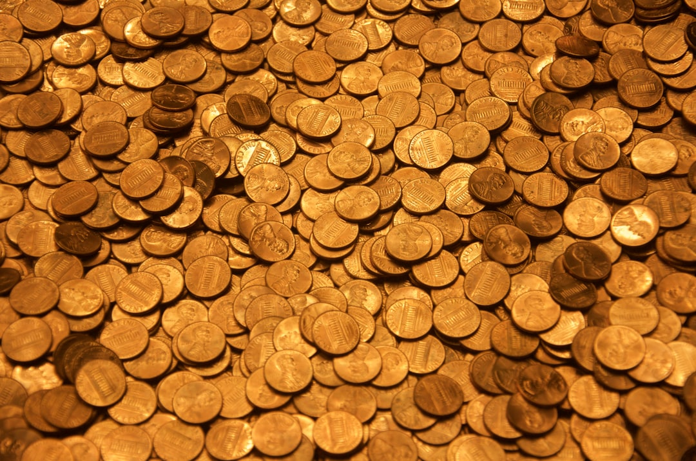

Mới bước chân vào thị trường với số vốn vài triệu đồng, bạn nhìn thấy cổ phiếu giá 3.000 đồng/cổ phiếu tăng trần liên tiếp nhiều phiên. Mức giá rẻ cảm giác rất dễ mua làm bạn muốn mua ngay. **[Value Investing](/)** giúp bạn hiểu rõ bản chất cổ phiếu penny là gì, những bẫy tâm lý nguy hiểm và rủi ro mất trắng nếu đầu cơ mù quáng.

## Cổ phiếu penny là gì — Khái niệm cần biết

**[Cổ phiếu](/dau-tu/co-phieu/co-phieu-la-gi/)** penny (còn gọi là **[cổ phiếu](/dau-tu/co-phieu/co-phieu-la-gi/)** rác hay micro-cap stock) là thuật ngữ chỉ các **[cổ phiếu](/dau-tu/co-phieu/co-phieu-la-gi/)** có thị giá rất nhỏ, thường thấp hơn mệnh giá quy định 10.000 đồng/cổ phiếu tại Việt Nam.

Doanh nghiệp phát hành cổ phiếu penny thường có quy mô vốn hóa nhỏ, kết quả kinh doanh kém khả quan hoặc đang trong giai đoạn tái cấu trúc gặp nhiều khó khăn.

Trái ngược với [cổ phiếu blue chip](/dau-tu/co-phieu/blue-chip-la-gi/) có nền tảng tài chính vững mạnh, cổ phiếu penny thường bị coi là nhóm chứng khoán mang tính rủi ro đầu cơ cao nhất.

## Bẫy tâm lý khiến nhà đầu tư F0 dính vào cổ phiếu penny

Không phải tự nhiên mà cổ phiếu penny lại thu hút rất nhiều người mới tham gia. Điều này xuất phát từ 3 bẫy tâm lý phổ biến:

* **Tâm lý giá rẻ dễ mua**. Với 10 triệu đồng, bạn chỉ mua được vài trăm cổ phiếu đầu ngành nhưng mua được hàng nghìn cổ phiếu penny.

* **Bẫy nhân đôi tài sản nhanh**. Một cổ phiếu giá 2.000 đồng chỉ cần tăng 2.000 đồng là bạn đã lãi 100%. Nhiều người nghĩ tăng từ 2.000 lên 4.000 dễ hơn từ 100.000 lên 200.000 đồng.

* **Hiệu ứng tâm lý đám đông (FOMO)**. Khi các hội nhóm hô hào khoe lãi cổ phiếu penny tăng trần, người mới rất dễ mất kiểm soát [tâm lý đầu tư chứng khoán](/dau-tu/co-phieu/tam-ly-dau-tu-chung-khoan/).

*Ảnh: Dan Dennis / Unsplash*

## Rủi ro nghiêm trọng khi mua cổ phiếu penny

Đằng sau những phiên tăng trần ấn tượng là những cạm bẫy có thể làm bạn mất sạch tiền tích lũy:

* **Rủi ro thao túng giá (đội lái)**. Do vốn hóa nhỏ và lượng cổ phiếu lưu hành ít, penny rất dễ bị các nhóm cá mập đẩy giá lên cao rồi xả hàng thoát nợ.

* **Mất thanh khoản khi giảm sàn**. Khi nhóm làm giá xả xong, cổ phiếu sẽ mất bên mua. Bạn có đặt lệnh bán giá sàn nhiều ngày liền cũng không ai mua.

* **Doanh nghiệp thua lỗ và hủy niêm yết**. Nhiều công ty penny làm ăn bết bát nhiều năm liền, đối mặt với nguy cơ bị dừng giao dịch hoặc hủy niêm yết bắt buộc.

## So sánh cổ phiếu penny và cổ phiếu blue chip

Để có cái nhìn tổng quan trước khi ra quyết định đầu tư, bạn có thể tham khảo bảng so sánh sau:

| Tiêu chí | Cổ phiếu Penny | Cổ phiếu Blue Chip |
|---|---|---|
| Mức giá | Thường dưới 10.000 đồng/cp | Thường trên 30.000 – 100.000 đồng/cp |
| Sức khỏe tài chính | Thua lỗ, nợ cao, kinh doanh yếu | Lợi nhuận tăng trưởng, tài chính lành mạnh |
| Tính thanh khoản | Biến động mạnh, dễ mất thanh khoản | Rất cao, mua bán dễ dàng hàng ngày |
| Mục đích phù hợp | Đầu cơ lướt sóng ngắn hạn | Đầu tư tích sản dài hạn |

## Lời khuyên cho F0 nếu muốn thử sức với penny

Nếu bạn vẫn muốn trải nghiệm cảm giác mạnh với nhóm cổ phiếu này, hãy tuân thủ 3 nguyên tắc sinh tồn sau:

1. **Tỷ trọng vốn cực nhỏ**. Chỉ sử dụng tối đa 5% tổng danh mục đầu tư cho cổ phiếu penny.

2. **Cắt lỗ tuyệt đối nghiêm ngặt**. Đặt ra kỷ luật bán ngay khi cổ phiếu vi phạm mức lỗ 7%–10%, không ôm hy vọng về bờ.

3. **Coi đây là tiền giải trí**. Hãy xác định tâm lý số tiền đầu tư penny nếu mất trắng cũng không ảnh hưởng tới cuộc sống gia đình.

Đầu tư chứng khoán là chặng đường dài hạn dựa trên giá trị doanh nghiệp. Hãy ưu tiên quản trị [rủi ro đầu tư chứng khoán](/dau-tu/co-phieu/rui-ro-dau-tu-chung-khoan/) để bảo vệ nguồn vốn của bạn.

---

*Tuyên bố miễn trừ trách nhiệm: Bài viết chỉ mang tính chất cung cấp thông tin giáo dục tài chính, không phải lời khuyên đầu tư hay khuyến nghị mua bán chứng khoán.*
 Để hiểu rõ hơn về chủ đề này, bạn có thể tham khảo thêm hướng dẫn **[cách đầu tư cổ phiếu](/dau-tu/co-phieu/cach-dau-tu-co-phieu/)**.
