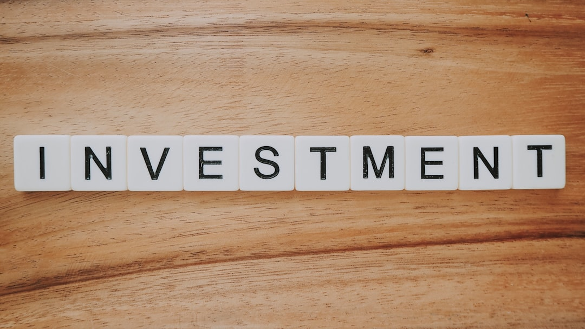

Giữa những đợt sóng rung lắc dữ dội của thị trường chứng khoán, khi nhiều tài khoản F0 chịu áp lực chốt lời hay cắt lỗ, cổ phiếu phòng thủ xuất hiện như một vịnh tránh bão êm đềm. **[Value Investing](/)** sẽ cùng bạn bóc tách bản chất của nhóm cổ phiếu này, giúp bạn xây dựng danh mục bền vững qua mọi biến động kinh tế.

## Cổ phiếu phòng thủ là gì?

Cổ phiếu phòng thủ (Defensive Stock) là cổ phiếu của những doanh nghiệp kinh doanh các sản phẩm và dịch vụ thiết yếu. Đây là những mặt hàng mà người tiêu dùng vẫn bắt buộc phải chi trả hàng ngày, bất kể nền kinh tế đang bùng nổ hay rơi vào suy thoái.

Hãy thử nghĩ thế này. Khi thu nhập giảm sút, bạn có thể hoãn việc mua quần áo mới hay đổi điện thoại đắt tiền. Tuy nhiên, bạn không thể ngừng trả tiền điện sinh hoạt, tiền nước sạch hay dừng mua thuốc khi ốm đau.

Chính vì nhu cầu tiêu dùng này không thay đổi, doanh thu và lợi nhuận của các doanh nghiệp phòng thủ luôn giữ được sự ổn định. Nhờ đó, giá **[cổ phiếu](/dau-tu/co-phieu/co-phieu-la-gi/)** của họ ít bị chao đảo theo tâm lý hoảng loạn của đám đông trên sàn giao dịch.

## 4 Đặc điểm cốt lõi nhận diện cổ phiếu phòng thủ

Để nhận biết chính xác một mã cổ phiếu có thuộc nhóm phòng thủ hay không, nhà đầu tư F0 có thể dựa vào 4 tiêu chí quan trọng dưới đây.

*Ảnh: Precondo CA / Unsplash*

* **Chỉ số Beta nhỏ hơn 1**. Beta đo lường mức độ biến động giá cổ phiếu so với VN-Index. Cổ phiếu có Beta dưới 1 thể hiện mức độ chao đảo thấp hơn thị trường chung. Khi thị trường giảm 10%, mã phòng thủ thường chỉ giảm 2% đến 4%.

* **Nhu cầu sản phẩm phi chu kỳ**. Hoạt động kinh doanh của doanh nghiệp không phụ thuộc vào chu kỳ kinh tế mở rộng hay thu hẹp.

* **Trả cổ tức bằng tiền mặt đều đặn**. Doanh nghiệp có dòng tiền kinh doanh vững chắc nên luôn duy trì lịch sử trả **[cổ tức](/dau-tu/co-phieu/co-tuc-la-gi/)** bằng tiền đều đặn qua nhiều năm liên tục.

* **Cơ cấu tài chính an toàn**. Doanh nghiệp thường duy trì tỷ lệ nợ vay thấp. Điều này giúp họ không bị áp lực gánh nặng lãi suất khi môi trường tiền tệ thắt chặt.

| Chỉ số nhận diện | Mức tiêu chuẩn | Ý nghĩa thực tế với F0 |
| :--- | :--- | :--- |
| Chỉ số Beta | < 1.0 (Ưu tiên < 0.8) | Giá cổ phiếu biến động rất êm |
| Tỷ lệ cổ tức/Thị giá | > 5% / năm | Cao hơn lãi suất tiền gửi tiết kiệm |
| Tỷ lệ Nợ/Vốn chủ sở hữu | < 0.5 | Ít rủi ro nợ nần khi lãi suất tăng |

## Các nhóm ngành phòng thủ tiêu biểu tại Việt Nam

Trên sàn giao dịch chứng khoán Việt Nam, nhóm cổ phiếu phòng thủ tập trung chủ yếu ở ba lĩnh vực kinh doanh nòng nốt.

### 1. Nhóm ngành Điện và Nước

Điện và nước là hai ngành tiện ích thiết yếu hàng đầu. Các doanh nghiệp trong ngành này thường sở hữu hạ tầng ổn định và hợp đồng bán hàng dài hạn. Những mã tiêu biểu trên sàn HOSE gồm có REE (Cơ điện lạnh), BWE (Nước môi trường Bình Dương) và POW (Điện lực Dầu khí).

### 2. Nhóm Hàng tiêu dùng thiết yếu

Nhóm này bao gồm các công ty sản xuất thực phẩm, đồ uống và mặt hàng gia dụng thiết yếu. Vinamilk (VNM) hay Sabeco (SAB) là những doanh nghiệp sở hữu mạng lưới phân phối rộng khắp. Dòng tiền bán hàng của họ diễn ra liên tục hàng ngày.

### 3. Nhóm Y tế và Dược phẩm

Nhu cầu chăm sóc sức khỏe và chữa bệnh luôn là ưu tiên hàng đầu trong mọi hoàn cảnh. Các công ty dược phẩm hàng đầu như Dược Hậu Giang (DHG) hay Imexpharm (IMP) duy trì biên lợi nhuận rất ổn định.

## Ưu điểm và hạn chế F0 cần biết trước khi đầu tư

Mọi nhóm tài sản trên thị trường đều có hai mặt. Việc hiểu rõ ưu và nhược điểm giúp bạn phân bổ vốn hợp lý.

### Ưu điểm vượt trội

* **Bảo vệ nguồn vốn**. Giảm thiểu rủi ro thua lỗ nặng trong các đợt thị trường sụt giảm sâu.

* **Tạo nguồn thu nhập thụ động**. Mang lại dòng tiền từ cổ tức tiền mặt định kỳ hàng năm.

* **Giữ vững tâm lý đầu tư**. Giúp bạn ngủ ngon mà không phải lo lắng canh bảng điện mỗi ngày.

### Hạn chế cần lưu ý

* **Tiềm năng tăng giá hạn chế**. Trong giai đoạn thị trường tăng trưởng mạnh (uptrend), cổ phiếu phòng thủ sẽ tăng chậm hơn nhiều so với cổ phiếu bất động sản hay chứng khoán.

* **Không phù hợp với lướt sóng**. Nhóm này không tạo ra những đợt sóng tăng giá x2 x3 trong thời gian ngắn.

Nhiều nhà đầu tư cũng thường kết hợp nhóm này với các mã **[cổ phiếu blue chip](/dau-tu/co-phieu/blue-chip-la-gi/)** để tối ưu hóa sự an toàn cho toàn bộ danh mục.

## Lời kết

Cổ phiếu phòng thủ không phải là công cụ làm giàu nhanh chóng. Đây là tấm lá chắn bảo vệ thành quả tài chính của bạn trước những biến động bất ngờ của thị trường.

Sự thật là một danh mục đầu tư khỏe mạnh luôn cần sự kết hợp hài hòa giữa công và thủ. Bước tiếp theo bạn có thể làm ngay hôm nay là lọc ra 1 doanh nghiệp ngành điện nước có lịch sử trả cổ tức > 5 năm trên sàn HOSE để theo dõi.
 Để hiểu rõ hơn về chủ đề này, bạn có thể tham khảo thêm hướng dẫn **[cách đầu tư cổ phiếu](/dau-tu/co-phieu/cach-dau-tu-co-phieu/)**.
