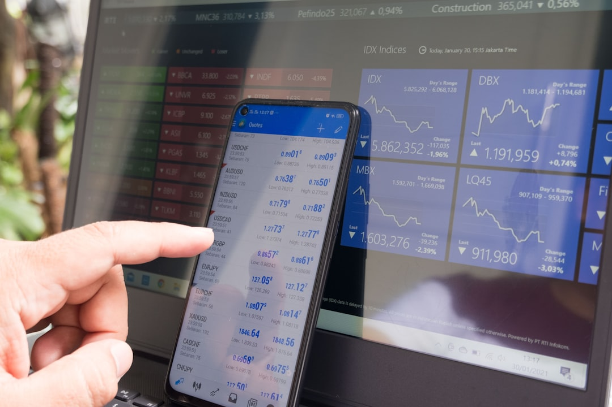

Trong cuộc đua số hóa của thị trường tài chính Việt Nam, hai cái tên đi đầu trong chiến dịch miễn phí giao dịch trọn đời là DNSE và TCBS. Cả hai đều hướng đến mô hình tự chủ, loại bỏ môi giới truyền thống để trả lại lợi ích cho khách hàng. Vậy khi đặt lên bàn cân **so sanh dnse va tcbs**, đâu là lựa chọn tối ưu cho bạn? Hãy cùng **[Value Investing](/)** phân tích chi tiết.

## Hai sàn chứng khoán Zero-Fee hàng đầu Việt Nam

Thị trường tài chính cá nhân chứng kiến làn sóng chuyển dịch mạnh mẽ sang các ứng dụng không phí. Trong số đó, DNSE và TCBS nổi lên như những người dẫn đầu phong trào miễn phí giao dịch. Cả hai công ty đều mang khát vọng định hình lại thói quen giao dịch của thế hệ trẻ.

Mô hình hoạt động của họ tập trung loại bỏ hoàn toàn hệ thống môi giới truyền thống. Đây là làn gió mới khi **[chọn công ty chứng khoán](/reviews/review-cong-ty-chung-khoan-cho-nguoi-moi/)** tự trading. Cách vận hành tinh gọn này giúp trả lại tối đa phần lợi ích chi phí cho khách hàng. Đây là điểm tương đồng lớn nhất khiến hai sàn thu hút lượng lớn tài khoản mở mới.

Tuy nhiên, mỗi bên lại chọn hướng phát triển công nghệ và dịch vụ vô cùng đặc trưng. DNSE tạo nên đột phá với hệ thống quản lý margin độc lập cho từng thương vụ. TCBS lại xác lập chỗ đứng bằng việc cung cấp giải pháp quản lý tài sản toàn diện.

Hiểu rõ bản chất sản phẩm của mỗi sàn sẽ giúp bạn xây dựng phương án giao dịch tối ưu. Chúng ta sẽ cùng mổ xẻ từng chi tiết để xem đâu là lựa chọn thích hợp cho bạn. Sự so sánh này sẽ tập trung vào hiệu quả chi phí và trải nghiệm vận hành thực tế.

## Phân tích 5 tiêu chí so sánh thực tế

Dưới đây là đối chiếu 5 khía cạnh thực tế giúp độc giả dễ dàng đưa ra đánh giá lựa chọn.

### 1. Cơ chế miễn phí giao dịch trọn đời (0% fee)

Chính sách zero-fee là thỏi nam châm thu hút khách hàng lớn nhất của cả hai sàn. DNSE miễn phí giao dịch cổ phiếu trọn đời khi bạn thực hiện lệnh mua bán trên Entrade X. Xem chi tiết tại bài **[đánh giá DNSE](/reviews/review-dnse-securities/)** về các điều khoản đi kèm. Chính sách này áp dụng vĩnh viễn và không đi kèm bất kỳ điều kiện ẩn nào.

TCBS cũng áp dụng tương tự với chính sách miễn 100% phí giao dịch cổ phiếu tự đặt. Nhà đầu tư tại cả hai bên chỉ cần thanh toán các khoản thuế phí nộp cho cơ quan nhà nước. Để duy trì doanh thu, cả hai công ty tập trung khai thác các mảng sản phẩm phụ.

Họ thu lợi nhuận chủ yếu từ dịch vụ cho vay ký quỹ và phân phối chứng chỉ quỹ. Chính sách này mang lại lợi ích rất lớn cho các nhà đầu tư tích sản dài hạn. Bạn có thể yên tâm giao dịch mà không lo phí môi giới bào mòn tài sản tích lũy.

### 2. Quản lý cho vay ký quỹ (Margin X theo deal vs Margin truyền thống)

Đây là tiêu chí tạo nên sự phân hóa sâu sắc nhất giữa DNSE và TCBS hiện nay. DNSE phát triển tính năng Margin X độc đáo, quản lý ký quỹ độc lập theo từng lệnh. Mỗi cổ phiếu bạn mua sẽ được thiết lập tỷ lệ vay và điểm cháy riêng biệt hoàn toàn.

Cơ chế deal-by-deal này giúp cô lập rủi ro của từng giao dịch đơn lẻ rất tốt. Nếu một mã cổ phiếu bị giảm mạnh, tài khoản tổng của bạn không bị ảnh hưởng trực tiếp. TCBS lại áp dụng mô hình quản lý margin theo tỷ lệ tổng tài sản truyền thống.

Sức mua margin của bạn được tính dựa trên giá trị của toàn bộ danh mục cổ phiếu nắm giữ. Nếu danh mục có một mã giảm sàn, bạn có thể phải bổ sung ký quỹ cho cả tài khoản. Đối với trader thích lướt sóng nhiều mã, Margin X của DNSE mang lại sự an tâm lớn.

### 3. Giao diện ứng dụng và trải nghiệm người dùng (Entrade X vs TCInvest)

DNSE thiết kế ứng dụng Entrade X hướng tới sự tối giản, mượt mà và trực quan nhất. Trải nghiệm đặt lệnh trên app diễn ra nhanh chóng, phù hợp với hành vi của Gen Z. Giao diện không chứa quá nhiều thông tin kỹ thuật giúp giảm tải bớt sự phức tạp.

Ứng dụng TCInvest của TCBS lại được ví như một cổng thông tin tài chính tích hợp khổng lồ. Hệ thống cung cấp rất nhiều báo cáo phân tích, biểu đồ kỹ thuật và định giá tự động. Tuy nhiên, giao diện của TCInvest bị nhiều người dùng đánh giá là tương đối nặng và khó dùng.

*Ảnh: Marga Santoso / Unsplash*

DNSE mang lại sự dễ chịu cho người mới nhờ bố cục thoáng đãng và hiện đại. TCBS lại thích hợp cho nhà đầu tư cần tra cứu nhiều số liệu doanh nghiệp chuyên sâu. Sự chọn lựa này phụ thuộc vào mức độ quan tâm của bạn đối với dữ liệu tài chính.

### 4. Môi giới và dịch vụ hỗ trợ nhà đầu tư

Cả DNSE và TCBS đều theo đuổi mô hình giảm tối đa sự can thiệp của con người. Bạn sẽ không có một môi giới tư vấn trực tiếp 1-1 hỗ trợ hàng ngày như sàn truyền thống. Toàn bộ quy trình từ mở tài khoản đến giao dịch đều được thực hiện trực tuyến.

Mọi yêu cầu hỗ trợ sẽ được xử lý qua hệ thống ticket trực tuyến hoặc chatbot tự động. Mô hình này giúp hai sàn cắt giảm chi phí nhưng đòi hỏi khách hàng phải có tính tự chủ. Nhiều F0 ban đầu có thể cảm thấy bỡ ngỡ khi không có người trực tiếp hướng dẫn đặt lệnh.

Tuy nhiên, hệ thống tài liệu hướng dẫn và video tự học của cả hai đều rất phong phú. Bạn hoàn toàn có thể tự trang bị kiến thức để vận hành tài khoản an toàn nhất. Việc tự học cũng giúp bạn hình thành tư duy độc lập và kỷ luật đầu tư cao.

### 5. Độ đa dạng sản phẩm tài chính và hệ sinh thái

TCBS tỏ ra vượt trội hoàn toàn so với đối thủ ở khía cạnh đa dạng sản phẩm. Là thành viên của Techcombank, TCBS cung cấp hệ sinh thái quản lý tài sản toàn diện. Khách hàng có thể mua trái phiếu iConnect, chứng chỉ quỹ mở TCBF và gửi tích lũy. Đọc thêm bài **[đánh giá TCBS](/reviews/review-tcbs-securities/)** để hiểu về danh mục trái phiếu và quỹ mở tại đây.

Hệ thống cho phép chuyển tiền tức thì không giây từ tài khoản Techcombank sang ví đầu tư. DNSE hiện tại tập trung chủ yếu vào giao dịch cổ phiếu, phái sinh và chứng chỉ quỹ. Hệ sinh thái sản phẩm bổ trợ của DNSE chưa thể phong phú và đa dạng bằng TCBS.

Nếu bạn cần một tài khoản đầu tư đa năng cho cả gia đình, TCBS là lựa chọn số một. DNSE sẽ phù hợp hơn nếu nhu cầu giao dịch của bạn chỉ xoay quanh cổ phiếu. Sự tập trung sản phẩm giúp giao diện của DNSE luôn giữ được vẻ tối giản.

## Nên chọn DNSE hay TCBS cho hành trình của bạn?

Lựa chọn giữa hai sàn chứng khoán zero-fee này phụ thuộc vào phong cách đầu tư của bạn. DNSE là bến đỗ tuyệt vời cho các trader năng động, giao dịch ngắn hạn nhiều mã cổ phiếu. Tính năng Margin X giúp bạn kiểm soát rủi ro độc lập từng deal một cách chủ động nhất. Giao diện Entrade X mượt mà giúp bạn đặt lệnh nhanh chóng mà không bị gián đoạn.

TCBS lại hướng đến đối tượng nhà đầu tư tích sản dài hạn, thích phân tích cơ bản doanh nghiệp. Hệ sinh thái sản phẩm phong phú và công cụ TCInvest tích hợp sâu là những điểm tựa đắc lực. Sự liên kết với ngân hàng Techcombank mang lại sự tiện lợi lớn cho dòng tiền nhàn rỗi.

Quyết định mở tài khoản bằng **[cách mở tài khoản chứng khoán](/dau-tu/co-phieu/cach-mo-tai-khoan-chung-khoan/)** trực tuyến là bước đệm giúp bạn tiếp cận thị trường tài chính thuận tiện. Nếu bạn quan tâm đến hệ sinh thái Techcombank, hãy tìm hiểu [cách mở tài khoản chứng khoán tcbs](/reviews/cach-mo-tai-khoan-chung-khoan-tcbs/) ngay. Bạn cũng nên đọc thêm bài viết [so sánh tcbs vs ssi](/reviews/so-sanh-tcbs-vs-ssi/) để có góc nhìn rộng hơn.

Nhiều nhà đầu tư chọn cách mở tài khoản DNSE để trading ngắn hạn bằng Margin X linh hoạt. Song song đó, họ duy trì tài khoản TCBS để nắm giữ cổ phiếu dài hạn và mua chứng chỉ quỹ. Sự kết hợp này giúp họ tận dụng tối đa thế mạnh chuyên biệt của cả hai nền tảng số.

---

**Tuyên bố miễn trừ trách nhiệm:** Thông tin trong bài viết được Value Investing tổng hợp từ các nguồn công khai công ty công bố tại thời điểm năm 2026. Bài viết mang tính chất tham khảo khách quan, không chứa khuyến nghị đầu tư hoặc cam kết tài chính nào. Độc giả nên tự kiểm tra lại các mức biểu phí thực tế trước khi đưa ra quyết định mở tài khoản.
