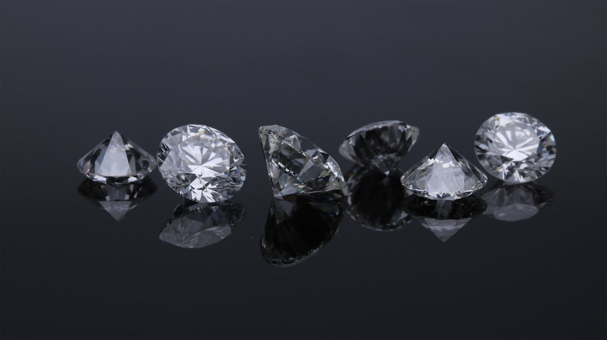

# Quỹ ETF Diamond Là Gì? Đánh Giá Tiềm Năng Đầu Tư Chứng Chỉ Quỹ FUEVFVND

Bạn đang tìm hiểu về Quỹ ETF VN Diamond (mã chứng chỉ quỹ FUEVFVND) - danh mục quy tụ các cổ phiếu hàng đầu hết room ngoại tại Việt Nam như FPT, PNJ, MWG? Bài viết này từ **[Value Investing](/)** sẽ giải thích chi tiết cơ chế hoạt động, cơ cấu danh mục và đánh giá xem có nên đầu tư vào ETF Diamond hay không.

## Quỹ ETF Diamond là gì? Mã chứng chỉ quỹ FUEVFVND

Quỹ ETF VFMVN DIAMOND (tên viết tắt là ETF Diamond, mã niêm yết trên sàn HOSE: FUEVFVND) là quỹ hoán đổi danh mục thụ động. Mục tiêu của quỹ là mô phỏng gần như chính xác biến động của chỉ số VN DIAMOND Index.

Tên gọi "Diamond" (Kim kim cương) tượng trưng cho những cổ phiếu chất lượng cao nhất trên thị trường chứng khoán Việt Nam. Đây là nhóm doanh nghiệp có nền tảng tài chính vững mạnh, cổ tức đều đặn và luôn trong tình trạng hở room ngoại nào là nhà đầu tư nước ngoài mua hết room đó.

Quỹ được quản lý bởi Công ty Quản lý Quỹ Dragon Capital Việt Nam (DCVFM). Để tìm hiểu khái niệm nền tảng về dòng sản phẩm này, bạn có thể tham khảo bài viết [quỹ ETF](/dau-tu/etf/etf-la-gi/).

## Chỉ số VN DIAMOND được cấu thành như thế nào?

Chỉ số VN DIAMOND Index do Sở Giao dịch Chứng khoán TP.HCM (HOSE) xây dựng và quản lý. Tiêu chuẩn để một cổ phiếu được kết nạp vào rổ chỉ số này khắt khe hơn nhiều so với VN30.

Điều kiện tiên quyết là hệ số sở hữu nước ngoài (FOL - Foreign Ownership Limit) phải đạt tối thiểu 95%. Điều này có nghĩa là cổ phiếu đó phải gần như đã cạn room dành cho nhà đầu tư ngoại.

Ngoài ra, doanh nghiệp phải đáp ứng các tiêu chuẩn về quy mô vốn hóa (trên 2.000 tỷ đồng) và thanh khoản giao dịch hàng ngày.

| Mã cổ phiếu | Tên doanh nghiệp | Ngành nghề chính |
|---|---|---|
| FPT | Tập đoàn FPT | Công nghệ thông tin |
| PNJ | Vàng bạc Đá quý Phú Nhuận | Bán lẻ trang sức |
| MWG | Thế Giới Di Động | Bán lẻ thiết bị di động & Bách Hóa |
| TCB | Ngân hàng Techcombank | Tài chính - Ngân hàng |
| REE | Cơ Điện Lạnh | Năng lượng & Hạ tầng |

*Ảnh: Edgar Soto / Unsplash*

## Vì sao ETF Diamond hấp dẫn cả khối ngoại lẫn nhà đầu tư F0 Việt Nam?

Sức hút của chứng chỉ quỹ FUEVFVND đến từ hai nhóm động lực chính trên thị trường.

Đối với nhà đầu tư nước ngoài, pháp luật Việt Nam giới hạn tỷ lệ sở hữu ngoại ở mức 49% (hoặc 30% đối với ngân hàng). Khi cổ phiếu tốt đã hết room, khối ngoại buộc phải trả mức giá chênh lệch (premium) rất cao để thỏa thuận ngoài sàn. Sự xuất hiện của FUEVFVND giúp khối ngoại sở hữu gián tiếp các cổ phiếu này mà không bị vướng trần pháp lý.

Đối với nhà đầu tư cá nhân F0 trong nước, ETF Diamond là giải pháp phân bổ vốn thông minh. Thay vì phải tốn thời gian phân tích và chọn lọc từng mã riêng lẻ, bạn chỉ cần mua một chứng chỉ quỹ duy nhất là đã sở hữu trọn gói danh mục các cổ phiếu tăng trưởng mạnh nhất Việt Nam.

## So sánh ETF Diamond (FUEVFVND) và ETF VN30 (E1VFVN30)

Dưới đây là bảng so sánh giúp bạn phân biệt hai quỹ ETF nội địa lớn nhất thị trường hiện nay.

| Tiêu chí | Quỹ ETF Diamond (FUEVFVND) | Quỹ ETF VN30 (E1VFVN30) |
|---|---|---|
| Chỉ số mô phỏng | VN DIAMOND Index | VN30 Index |
| Tiêu chí lọc | Hết room ngoại + Thanh khoản | Top 30 vốn hóa lớn nhất sàn HOSE |
| Ngành chiếm tỷ trọng cao | Ngân hàng, Công nghệ, Bán lẻ | Ngân hàng, Bất động sản |
| Phong cách danh mục | Tập trung cổ phiếu tăng trưởng | Tập trung cổ phiếu trụ vốn hóa lớn |

Để có góc nhìn đa chiều hơn về các sản phẩm quỹ, bạn có thể tham khảo thêm bài viết [ETF VN30](/dau-tu/etf/etf-vn30-la-gi/) hoặc đọc hướng dẫn [cách đầu tư quỹ etf](/dau-tu/etf/cach-dau-tu-quy-etf/).

## Hướng dẫn cách mua chứng chỉ quỹ ETF Diamond FUEVFVND

Cách sở hữu chứng chỉ quỹ FUEVFVND cực kỳ đơn giản vì quỹ được niêm yết và giao dịch trực tiếp trên sàn HOSE tương tự một mã cổ phiếu.

* **Bước 1**. Mở ứng dụng chứng khoán trên điện thoại của bạn (như TCBS, VPS, SSI...).
* **Bước 2**. Nhập mã chứng khoán **FUEVFVND** vào thanh tìm kiếm.
* **Bước 3**. Nhập số lượng mua (bội số của 100) và chọn mức giá LO bạn mong muốn.
* **Bước 4**. Bấm **Xác nhận** và nhập mã Smart OTP để hoàn tất giao dịch.

> **Tuyên bố miễn trừ trách nhiệm:** Thông tin trong bài viết mang tính chất kiến thức tổng hợp và phân tích khách quan. Bài viết không chứa liên kết tài trợ và không phải là lời khuyên ủy thác đầu tư tài chính.
