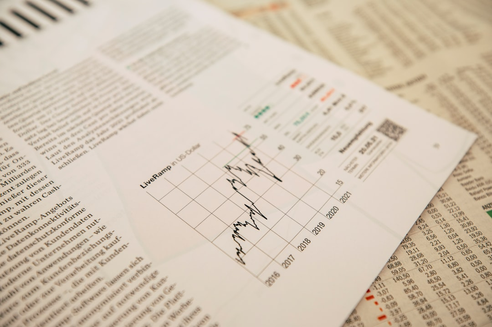

Nhiều người mới tham gia thị trường thường mua cổ phiếu theo tin đồn hoặc phím hàng mà không biết doanh nghiệp mình sở hữu làm ăn ra sao. Sự thật là, hiểu rõ **phan tich co ban la gi** qua blog **[Value Investing](/)** sẽ giúp bạn tự tay chọn lọc những doanh nghiệp xuất sắc và tránh xa các cái bẫy thua lỗ.

## Phân tích cơ bản là gì?

Hãy thử nghĩ thế này. Khi bạn quyết định xuống tiền mua một ngôi nhà, bạn chắc chắn không chỉ nhìn vào màu sơn bên ngoài. Bạn sẽ đi kiểm tra phần móng nhà có vững chãi không. Bạn xem khu vực xung quanh có dễ bị ngập nước hay không. Bạn tính toán dòng tiền cho thuê nhà mỗi tháng được bao nhiêu.

Phân tích cơ bản trong đầu tư tài chính cũng hoạt động hoàn toàn tương tự như vậy. Phương pháp này tập trung đo lường giá trị nội tại của một doanh nghiệp. Mục tiêu là tìm ra giá trị thực tế của doanh nghiệp đó. Từ đó, bạn đối chiếu với giá thị trường hiện tại để hành động.

Nếu giá cổ phiếu trên bảng điện rẻ hơn giá trị nội tại, đây là cơ hội mua tích lũy tốt. Nếu giá thị trường đắt hơn nhiều so với giá trị thực tế, bạn nên tránh xa. Triết lý này được khởi xướng bởi cha đẻ đầu tư giá trị Benjamin Graham. Phương pháp giúp bạn đầu tư dựa trên nền tảng kinh doanh thực tế của doanh nghiệp. Bạn sẽ không bị cuốn theo những biến động tăng giảm ngắn hạn của đám đông.

Thị trường chứng khoán trong ngắn hạn hoạt động như một máy bỏ phiếu bằng cảm xúc. Tuy nhiên, về dài hạn, thị trường sẽ là một chiếc cân đo chính xác giá trị doanh nghiệp. Phân tích cơ bản chính là chiếc cân giúp bạn tìm ra những viên kim cương thô.

## Hai mảnh ghép cấu thành phân tích cơ bản

Để đánh giá một doanh nghiệp, bạn cần sử dụng cả hai loại phân tích này. Chúng giống như hai mắt giúp bạn nhìn rõ độ sâu của thị trường. Nếu thiếu một trong hai, quyết định đầu tư của bạn sẽ bị lệch lạc.

Nhiều nhà đầu tư mới thường chỉ tập trung vào các con số tài chính khô khan. Họ bỏ qua các yếu tố về con người và triển vọng kinh doanh thực tế. Ngược lại, một số người chỉ mua vì nghe kể câu chuyện tăng trưởng hay từ các hội nhóm. Họ không hề biết doanh nghiệp đang ngập trong nợ nần nguy hiểm.

Sự kết hợp hài hòa giữa định tính và định lượng mang lại cái nhìn toàn diện. Bạn sẽ hiểu được tại sao doanh nghiệp tạo ra doanh thu lớn. Bạn cũng đánh giá được doanh thu đó có bền vững qua nhiều năm hay không.

| Yếu tố phân tích | Định nghĩa | Công cụ chính |
| :--- | :--- | :--- |
| **Phân tích định tính** | Đánh giá các khía cạnh phi con số | Lợi thế cạnh tranh, ban lãnh đạo, mô hình kinh doanh |
| **Phân tích định lượng** | Phân tích số liệu tài chính cụ thể | Báo cáo tài chính, các chỉ số định giá, chỉ số hiệu quả |

Việc thấu hiểu cả hai khía cạnh này đòi hỏi sự kiên nhẫn học hỏi nghiêm túc. Định tính cho bạn biết doanh nghiệp có gì độc quyền để phát triển mạnh. Định lượng giúp bạn kiểm tra xem lời hứa của ban lãnh đạo có thành sự thật không. Đây chính là cách các nhà đầu tư lớn bảo vệ nguồn vốn của họ.

### Phân tích định tính (Phần nổi của tảng băng)

Phân tích định tính tập trung vào những giá trị không thể đo lường bằng những con số. Đầu tiên là năng lực và sự trung thực của ban điều hành doanh nghiệp. Một ban lãnh đạo xuất sắc sẽ biết cách chèo lái công ty vượt qua khủng hoảng. Họ luôn minh bạch thông tin và tôn trọng quyền lợi của cổ đông nhỏ lẻ.

Tiếp theo là lợi thế cạnh tranh độc quyền hay còn gọi là con hào kinh tế. Lợi thế này có thể đến từ thương hiệu lâu đời hoặc chi phí sản xuất cực thấp. Cuối cùng là triển vọng tăng trưởng chung của toàn ngành kinh doanh trong dài hạn. Một doanh nghiệp tốt nằm trong ngành đang thoái trào cũng khó tăng trưởng mạnh. Bạn có thể tìm các thông tin này qua báo cáo thường niên hoặc các bài phỏng vấn ban lãnh đạo để đánh giá chuẩn xác nhất.

### Phân tích định lượng (Phần chìm dưới nước)

Phân tích định lượng giúp bạn kiểm tra sức khỏe tài chính bằng số liệu cụ thể. Công việc chính là đọc hiểu ba báo cáo tài chính cốt lõi của doanh nghiệp. Đó là bảng cân đối kế toán, báo cáo kết quả kinh doanh, và báo cáo lưu chuyển tiền tệ. Những tài liệu này được công bố định kỳ mỗi quý và mỗi năm.

Bạn cần sử dụng các chỉ số định giá quen thuộc để phân tích. Ví dụ điển hình là chỉ số P/E, chỉ số P/B và chỉ số EPS. Các chỉ số này giúp bạn so sánh giá cổ phiếu với lợi nhuận thực tế kiếm được. Bạn cũng phải theo dõi các chỉ số sinh lời như ROE để đánh giá hiệu quả sử dụng vốn. Những con số này không biết nói dối và phản ánh trung thực kết quả kinh doanh.

## Quy trình phân tích cơ bản từ vĩ mô đến vi mô

Nhà đầu tư chuyên nghiệp thường áp dụng quy trình phân tích từ trên xuống dưới. Cách tiếp cận này giúp bạn lọc dần cơ hội đầu tư một cách khoa học. Bạn sẽ không bị lạc lối giữa hàng nghìn mã cổ phiếu trên sàn giao dịch.

*   **Phân tích kinh tế vĩ mô**. Bước này giúp bạn đánh giá bức tranh kinh tế chung của quốc gia. Các yếu tố cần theo dõi là xu hướng lãi suất, tỷ lệ lạm phát và tăng trưởng GDP. Lãi suất giảm thường là môi trường tốt cho thị trường chứng khoán phát triển. Ngược lại, lãi suất tăng cao sẽ hút dòng tiền về kênh tiết kiệm an toàn.

*   **Phân tích ngành dọc**. Bạn cần chọn lọc các ngành có tiềm năng phát triển tốt nhất. Hãy tìm những ngành được hưởng lợi trực tiếp từ chính sách vĩ mô của Chính phủ. Tránh các ngành đang bước vào giai đoạn bão hòa hoặc chịu cạnh tranh gay gắt. Một ngành đang lên sẽ nâng đỡ cả những doanh nghiệp trung bình trong ngành.

*   **Phân tích nội tại doanh nghiệp**. Đây là bước cuối cùng và chi tiết nhất trong quy trình phân tích. Bạn sẽ đi sâu vào báo cáo tài chính của từng doanh nghiệp trong ngành đã chọn. Đánh giá khả năng trả nợ ngắn hạn, biên lợi nhuận và tốc độ tăng trưởng. Từ đó, bạn tính toán giá trị nội tại để đưa ra quyết định mua bán.

Áp dụng quy trình này giúp bạn loại bỏ hoàn toàn các cổ phiếu rác kém chất lượng. Bạn sẽ tập trung nguồn lực tài chính vào những doanh nghiệp khỏe mạnh nhất. Đây là bước đệm vững chắc cho hành trình tích sản dài hạn của bạn.

## Sự khác biệt giữa Phân tích cơ bản và Phân tích kỹ thuật

Hai trường phái phân tích này có những điểm khác biệt rất lớn về mặt tư duy. Việc hiểu rõ sự khác nhau giúp bạn áp dụng đúng lúc vào thực tế.

| Tiêu chí | Phân tích cơ bản | Phân tích kỹ thuật |
| :--- | :--- | :--- |
| **Mục tiêu chính** | Tìm kiếm giá trị nội tại | Tìm kiếm xu hướng dòng tiền |
| **Công cụ sử dụng** | Báo cáo tài chính, vĩ mô | Biểu đồ nến, chỉ báo kỹ thuật |
| **Tầm nhìn đầu tư** | Dài hạn (tính bằng năm) | Ngắn hạn (tính bằng ngày/tuần) |

Nhà đầu tư theo trường phái cơ bản tin rằng giá cả sẽ hội tụ về giá trị thực. Họ kiên nhẫn chờ đợi và không quan tâm nhiều đến biến động hàng ngày. Trong khi đó, nhà [phân tích kỹ thuật](/phan-tich/ky-thuat/phan-tich-ky-thuat-la-gi/) lại tập trung vào hành động giá tức thời. Họ muốn tối đa hóa lợi nhuận bằng cách lướt sóng theo dòng tiền thị trường.

Mỗi phương pháp đều có những ưu điểm và hạn chế riêng đối với người mới. Bạn không cần phải chọn một trong hai và bài trừ phương pháp còn lại. Thực tế, nhiều nhà đầu tư lớn thường kết hợp linh hoạt cả hai để đạt hiệu quả cao. Họ dùng cơ bản để **[chọn cổ phiếu tốt](/dau-tu/co-phieu/cach-chon-co-phieu-tot/)** và dùng kỹ thuật để chọn điểm mua tối ưu.

> **Lời khuyên:** Nhà đầu tư thông minh nên kết hợp cả hai phương pháp. Bạn dùng phân tích cơ bản để chọn cổ phiếu tốt. Sau đó, bạn dùng phân tích kỹ thuật để tìm điểm mua có giá tốt nhất.

*Ảnh: Markus Spiske / Unsplash*

## Lời khuyên cho hành động tiếp theo

Phân tích cơ bản không phải là thứ gì đó quá xa vời hay chỉ dành cho chuyên gia. Việc hiểu rõ hoạt động kinh doanh giúp bạn tự tin nắm giữ cổ phiếu qua các đợt rung lắc.

Bước tiếp theo bạn có thể làm ngay là tải báo cáo tài chính gần nhất của Vinamilk hoặc Hòa Phát. Hãy thử tìm xem doanh thu của họ tăng hay giảm so với năm trước.

Bạn hãy đọc thêm bài viết về [chỉ số P/E là gì](/phan-tich/co-ban/pe-la-gi/) để biết cách định giá một cổ phiếu cụ thể.
