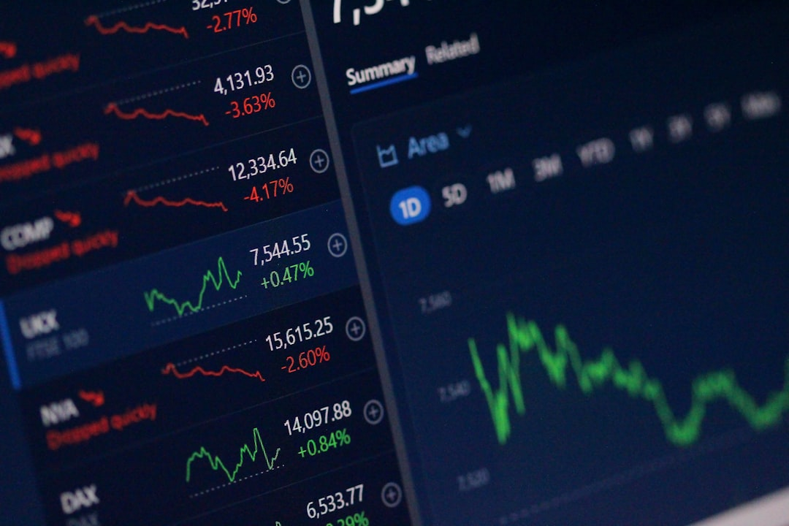

Bạn đã nghe nhiều người nói về các công cụ phái sinh giúp phòng vệ tài khoản hoặc nhân nhiều lần lợi nhuận với số vốn ban đầu nhỏ. Bạn tò mò muốn biết quyền chọn (Option) là gì và nó hoạt động ra sao tại thị trường chứng khoán. Hãy cùng tìm hiểu khái niệm tài chính nâng cao này qua bài viết của blog **[Value Investing](/)** bằng các ví dụ đơn giản và dễ hiểu nhất dưới đây.

## Khái niệm quyền chọn (Option) trong đầu tư

Quyền chọn là một loại hợp đồng phái sinh cho phép người mua có quyền, nhưng không có nghĩa vụ, thực hiện giao dịch mua hoặc bán tài sản. Tài sản cơ sở này có thể là cổ phiếu, trái phiếu hoặc hàng hóa tại một mức giá thỏa thuận trước. Quyền này chỉ có giá trị hiệu lực trong một khoảng thời gian xác định trước khi đáo hạn.

Hãy thử nghĩ thế này. Bạn muốn mua một căn hộ chung cư có giá bán là 2 tỷ đồng tại Hà Nội. Bạn quyết định đặt cọc cho chủ nhà 50 triệu đồng để giữ quyền mua căn nhà này với giá 2 tỷ trong vòng 3 tháng. Số tiền cọc 50 triệu đồng này đóng vai trò giống như phí quyền chọn (premium) để mua quyền mua nhà.

Sau 3 tháng, nếu giá căn hộ tăng lên 2.5 tỷ đồng, bạn chắc chắn sẽ thực hiện quyền mua nhà với giá thỏa thuận là 2 tỷ. Bạn đã kiếm được khoản lời gián tiếp rất lớn nhờ việc đặt cọc giữ quyền. Ngược lại, nếu giá căn hộ giảm xuống chỉ còn 1.8 tỷ đồng, bạn có quyền bỏ cọc và không mua căn hộ đó nữa.

Khoản lỗ tối đa của bạn lúc này chỉ là 50 triệu đồng tiền cọc ban đầu chứ không phải chịu khoản lỗ sâu do mua nhà đắt. Đây chính là bản chất cốt lõi của [chứng khoán phái sinh](/dau-tu/phai-sinh/phai-sinh-la-gi/) quyền chọn.

## Phân loại quyền chọn: Quyền chọn mua và Quyền chọn bán

Hợp đồng quyền chọn được phân chia làm hai loại hình cơ bản để phục vụ các nhu cầu phòng vệ và đầu cơ khác nhau của nhà đầu tư. Tùy thuộc vào dự báo xu hướng thị trường, bạn có thể lựa chọn loại quyền chọn phù hợp dưới đây:

*   **Quyền chọn mua (Call Option)**. Loại hợp đồng này cho phép bạn có quyền mua tài sản cơ sở với mức giá ấn định trước. Nhà đầu tư thường mua quyền chọn mua khi kỳ vọng giá tài sản cơ sở sẽ tăng mạnh trong tương lai. Ví dụ, bạn tin rằng cổ phiếu HPG sắp tăng giá từ 30 nghìn lên 40 nghìn đồng, bạn sẽ mua quyền chọn mua với giá thực hiện 32 nghìn đồng để hiện thực hóa lợi nhuận.

*   **Quyền chọn bán (Put Option)**. Loại hợp đồng này cho phép bạn có quyền bán tài sản cơ sở với mức giá ấn định trước. Nhà đầu tư thường mua quyền chọn bán để phòng vệ tài khoản khi dự báo thị trường sắp lao dốc.

Vị thế của hai bên tham gia cũng rất rõ ràng. Người mua quyền chọn trả phí để có quyền giao dịch và có mức rủi ro giới hạn. Ngược lại, người bán quyền chọn nhận phí nhưng phải chịu nghĩa vụ thực hiện giao dịch bất lợi khi người mua yêu cầu. Người bán quyền chọn do đó phải chịu mức rủi ro thua lỗ vô hạn nếu thị trường biến động quá mạnh. Việc hiểu rõ rủi ro và quyền lợi của mỗi vị thế mua bán này là yếu tố sống còn giúp bạn tránh được những khoản lỗ không đáng có khi tham gia thị trường phái sinh nâng cao.

## Các yếu tố cấu thành hợp đồng quyền chọn

Một hợp đồng quyền chọn chuẩn hóa giao dịch trên thị trường luôn bao gồm 4 yếu tố kỹ thuật bắt buộc sau. Bạn cần nắm rõ các thông số này trước khi bắt đầu đặt lệnh giao dịch:

*   **Tài sản cơ sở**. Loại tài sản được mang ra làm đối chiếu để thực hiện quyền giao dịch như cổ phiếu, trái phiếu hay rổ chỉ số VN30.

*   **Giá thực hiện (Strike Price)**. Mức giá cố định đã thỏa thuận trước để người mua thực hiện quyền mua hoặc bán tài sản cơ sở đó vào ngày đáo hạn.

*   **Phí quyền chọn (Option Premium)**. Số tiền người mua phải trả trực tiếp cho người bán để sở hữu quyền chọn giao dịch, khoản phí này sẽ không được hoàn lại trong bất kỳ trường hợp nào.

*   **Ngày đáo hạn**. Thời điểm cuối cùng hợp đồng quyền chọn còn giá trị hiệu lực thực thi quyền, sau ngày này hợp đồng sẽ trở nên vô giá trị.

Các thông số kỹ thuật này được quy định cực kỳ chi tiết trong bản cáo bạch hoặc quy chế giao dịch của sàn nhằm đảm bảo tính công bằng cho tất cả các thành viên tham gia thị trường.

## Điểm khác biệt giữa quyền chọn và hợp đồng tương lai

Điểm khác biệt lớn nhất nằm ở tính bắt buộc thực hiện nghĩa vụ khi đến ngày đáo hạn hợp đồng. Đối với [hợp đồng tương lai](/dau-tu/phai-sinh/hop-dong-tuong-lai-la-gi/), cả hai bên mua và bán đều bắt buộc phải thực hiện nghĩa vụ thanh toán vào ngày đáo hạn. Ngược lại, người mua quyền chọn hoàn toàn có quyền bỏ không thực hiện quyền nếu giá thị trường biến động bất lợi cho họ.

Sự khác biệt này cũng dẫn tới cấu trúc rủi ro rất khác nhau giữa hai sản phẩm phái sinh này. Người mua quyền chọn có mức rủi ro giới hạn tối đa bằng khoản phí quyền chọn đã trả ban đầu. Trong khi đó, rủi ro của cả hai bên tham gia hợp đồng tương lai là không giới hạn và biến động liên tục theo sát điểm số thực tế của rổ chỉ số thị trường. Bên cạnh đó, việc ký quỹ giao dịch của hợp đồng tương lai cũng phức tạp hơn nhiều do có thể bị gọi ký quỹ (call margin) hàng ngày theo biến động giá thực tế của thị trường.

## Cách ứng dụng quyền chọn thực tế cho nhà đầu tư

Mục đích chính của quyền chọn là giúp bạn phòng ngừa rủi ro cho danh mục cổ phiếu cơ sở đang nắm giữ. Nếu bạn sở hữu nhiều cổ phiếu và sợ thị trường giảm, việc mua quyền chọn bán sẽ hoạt động như một gói bảo hiểm tài sản. Khi thị trường giảm, lợi nhuận từ quyền chọn bán sẽ bù đắp phần lỗ của cổ phiếu cơ sở.

Ngược lại, bạn cũng có thể sử dụng quyền chọn để đầu cơ sinh lời cao với số vốn nhỏ. Bằng việc mua quyền chọn mua thay vì mua trực tiếp cổ phiếu, bạn có thể kiểm soát lượng tài sản lớn hơn nhiều lần số vốn bỏ ra nhờ tính chất đòn bẩy tài chính cao của sản phẩm.

Bạn có thể tìm hiểu thêm về các công cụ phòng vệ qua bài hướng dẫn [cách đầu tư chứng khoán phái sinh](/dau-tu/phai-sinh/cach-dau-tu-chung-khoan-phai-sinh/) để đa dạng hóa danh mục đầu tư của bản thân.

*Ảnh: Anne Nygård / Unsplash*

## Câu hỏi thường gặp

### Phí quyền chọn (Premium) có được trả lại khi tôi không thực hiện quyền không?
Có. Phí quyền chọn là chi phí mua cơ hội để sở hữu quyền và được thanh toán trực tiếp cho người bán ngay khi ký hợp đồng. Khoản phí này sẽ mất đi nếu bạn quyết định bỏ quyền chọn khi đáo hạn.

### Ở Việt Nam tôi có thể tự giao dịch quyền chọn cổ phiếu cá nhân không?
Hiện tại, thị trường chứng khoán Việt Nam chưa triển khai sản phẩm quyền chọn cổ phiếu trực tiếp cho nhà đầu tư cá nhân giao dịch rộng rãi. Tuy nhiên, bạn có thể tìm hiểu sản phẩm chứng quyền có bảo đảm (Covered Warrant) giao dịch trên sàn HOSE với cơ chế tương tự.

Quyền chọn là công cụ tài chính phái sinh đỉnh cao giúp quản trị rủi ro danh mục hiệu quả. Bạn hãy bắt đầu bằng việc đọc kỹ bảng giá chứng quyền trên HOSE để quan sát cách phí quyền chọn biến động theo giá cổ phiếu cơ sở. Hành động này giúp bạn làm quen trước khi tham gia thị trường phái sinh thực tế.
