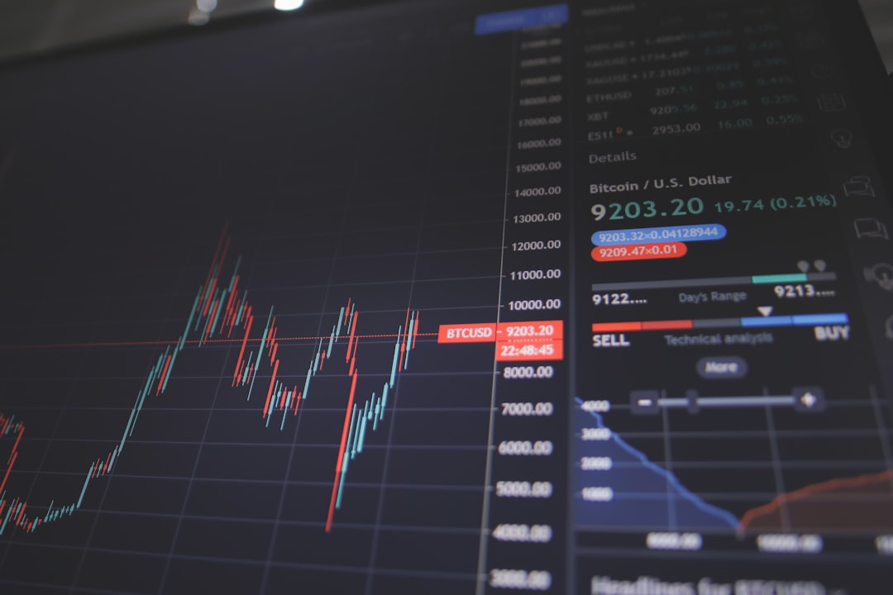

# Đánh giá Công ty Chứng khoán Mirae Asset (MAS): Phí, Margin và Ứng Dụng Giao Dịch

Bạn đang cân nhắc mở tài khoản tại chứng khoán Mirae Asset (MAS) vì nghe nói lãi suất margin ưu đãi và nguồn vốn dồi dào từ Tập đoàn tài chính Hàn Quốc? Trong bài viết này từ **[Value Investing](/)**, chúng ta sẽ đánh giá toàn diện ưu nhược điểm, chi phí thực tế và ứng dụng giao dịch của Mirae Asset.

## Tổng quan về Chứng khoán Mirae Asset Việt Nam (MAS)

Công ty Cổ phần Chứng khoán Mirae Asset Việt Nam (MAS) là thành viên của Tập đoàn Tài chính Mirae Asset đến từ Hàn Quốc. Gia nhập thị trường Việt Nam từ năm 2007, MAS đã liên tục tăng vốn để trở thành một trong những CTCK có quy mô vốn lớn nhất.

Với vốn điều lệ vượt mốc 6.500 tỷ đồng, MAS đứng trong Top 3 công ty có tiềm lực tài chính mạnh nhất thị trường. Nguồn vốn dồi dào từ tập đoàn mẹ giúp công ty có lợi thế tuyệt đối trong việc tài trợ đòn bẩy tài chính cho khách hàng.

Trên các bảng xếp hạng môi giới, MAS luôn giữ vững vị trí trong Top 10 thị phần trên cả hai sàn HOSE và HNX.

## Phí giao dịch và các gói cho vay margin tại Mirae Asset

Phí giao dịch và lãi suất cho vay ký quỹ là hai chỉ số tạo nên sức hút lớn nhất của Mirae Asset đối với các nhà đầu tư cá nhân năng động.

Mức phí giao dịch cổ phiếu trực tuyến qua nền tảng điện tử tại MAS ấn định ở mức 0.15%. Đây là mức phí chuẩn mực phổ biến, không quá rẻ nhưng rất hợp lý so với quy mô dịch vụ.

| Gói dịch vụ | Mức phí giao dịch | Lãi suất Margin ước tính |
|---|---|---|
| Tự giao dịch Online | 0.15% | 11.5% - 12.5%/năm |
| Môi giới chăm sóc | 0.20% - 0.25% | 12.5% - 13.5%/năm |
| Gói ưu đãi tân thủ | 0.15% | 7.99% - 9.99%/năm (cố định 3 tháng) |

Điểm sáng lớn nhất của MAS chính là chính sách [giao dịch ký quỹ (margin)](/dau-tu/co-phieu/margin-la-gi/). Trong khi nhiều công ty chứng khoán nội địa thường rơi vào tình trạng hết room margin vào những giai đoạn thị trường bùng nổ, MAS luôn duy trì nguồn đạn margin dồi dào với hạn mức vay cao cho từng mã cổ phiếu.

*Ảnh: Nick Chong / Unsplash*

## Đánh giá ứng dụng giao dịch My Asset / MAFS

Mirae Asset liên tục cải tiến hệ thống công nghệ thông qua hai nền tảng chính: Ứng dụng di động My Asset và phần mềm MAFS trên máy tính.

Ứng dụng My Asset sở hữu nhiều tính năng hỗ trợ nhà đầu tư như đặt lệnh nâng cao, quản lý danh mục chi tiết và hệ thống cảnh báo giá tự động. Tốc độ cập nhật dữ liệu bảng giá đạt chuẩn thời gian thực.

Tuy nhiên, giao diện của My Asset được thiết kế theo phong cách Hàn Quốc với nhiều thông số kỹ thuật trên một màn hình. Điều này có thể khiến người mới bắt đầu cảm thấy hơi rối mắt trong những lần đầu sử dụng.

## Ưu điểm và nhược điểm của Chứng khoán Mirae Asset

Dưới đây là tổng hợp những điểm cộng và điểm trừ của MAS giúp bạn cân nhắc chính xác hơn.

* **Kho margin cực lớn và đa dạng**. Tỷ lệ cho vay cao, danh mục hỗ trợ margin rộng và hiếm khi bị cạn room cho vay.
* **Lãi suất margin cạnh tranh**. Thường xuyên tung ra các gói margin ưu đãi dưới 10%/năm cho nhà đầu tư mới.
* **Độ an toàn tài chính tuyệt đối**. Nhờ sự bảo trợ vững chắc từ tập đoàn tài chính toàn cầu Mirae Asset.
* **Chăm sóc khách hàng cá nhân chưa quá rầm rộ**. Hoạt động marketing và hỗ trợ cộng đồng tại Việt Nam còn khá trầm lắng so với VPS hay TCBS.

## So sánh Mirae Asset với VPS và TCBS

Bảng so sánh sau đây giúp bạn đối chiếu MAS với các thương hiệu dẫn đầu thị phần khác.

| Tiêu chí | Mirae Asset (MAS) | Chứng khoán VPS | Chứng khoán TCBS |
|---|---|---|---|
| Thị phần môi giới | Top 6 - Top 8 | Top 1 (Thị phần lớn nhất) | Top 3 - Top 4 |
| Nguồn Margin | Rất dồi dào | Dồi dào nhưng dễ chật room | Dồi dào |
| Lãi suất Margin | 8.0% - 12.5%/năm | 12.5% - 14.0%/năm | 10.5% - 12.0%/năm |
| Phí giao dịch | 0.15% | 0.13% - 0.15% | 0.10% |

Để tìm hiểu thêm về tiêu chí chọn sàn phù hợp, bạn có thể đọc bài hướng dẫn [chọn công ty chứng khoán cho người mới](/reviews/review-cong-ty-chung-khoan-cho-nguoi-moi/) hoặc tham khảo các lựa chọn trong nhóm [công ty chứng khoán phí thấp](/reviews/cong-ty-chung-khoan-phi-thap/).

## Ai nên chọn mở tài khoản tại Mirae Asset?

Mirae Asset là điểm đến lý tưởng cho những nhà đầu tư cá nhân có xu hướng sử dụng đòn bẩy tài chính margin thường xuyên. Nếu bạn cần một nơi có nguồn cho vay ổn định, không lo bị siết margin đột ngột và muốn tối ưu chi phí lãi vay thì MAS là một lựa chọn hàng đầu.

> **Tuyên bố miễn trừ trách nhiệm:** Nội dung bài viết mang tính chất thông tin và đánh giá độc lập. Bài viết không chứa liên kết tài trợ ẩn và không cấu thành lời khuyên mua bán chứng khoán hay sử dụng đòn bẩy tài chính.
