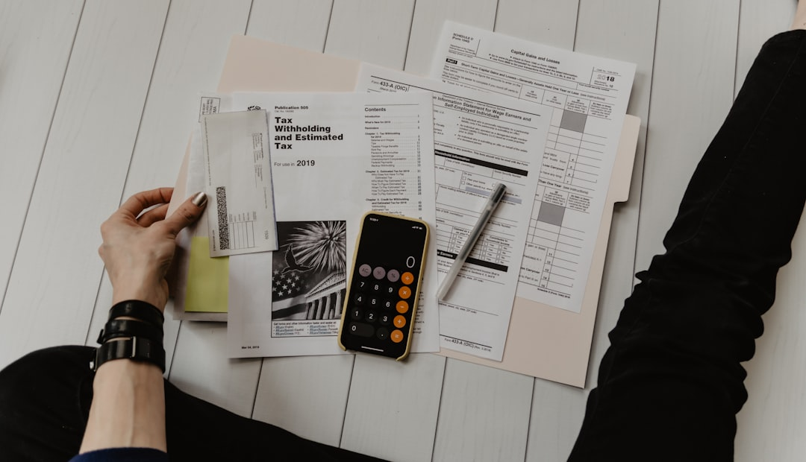

Nhiều bạn đang dùng tài khoản ngân hàng Vietcombank tự hỏi liệu có nên mở tài khoản chứng khoán VCBS để tiện quản lý tiền. Bài viết này **[Value Investing](/)** sẽ đánh giá chi tiết ưu nhược điểm, biểu phí và giao diện app của VCBS để bạn dễ dàng đưa ra quyết định.

## Giới thiệu tổng quan về công ty chứng khoán VCBS

Công ty TNHH Chứng khoán Ngân hàng TMCP Ngoại thương Việt Nam (VCBS) là một trong những định chế tài chính đời đầu tại Việt Nam. Được thành lập từ năm 2002, VCBS tự hào là đơn vị thành viên do ngân hàng Vietcombank sở hữu 100% vốn điều lệ. Trải qua hơn hai thập kỷ hoạt động, VCBS đã khẳng định được vị thế vững chắc trong nhóm những công ty môi giới uy tín hàng đầu thị trường.

Sự bảo trợ tuyệt đối từ ngân hàng mẹ Vietcombank mang lại cho VCBS nguồn lực tài chính dồi dào và nền tảng quản trị rủi ro vững chắc. Khác với mô hình vốn ngoại như bài [đánh giá Mirae Asset](/reviews/review-mirae-asset-securities/), VCBS vận hành theo chuẩn mực ngân hàng trong nước cực kỳ cẩn trọng. Điều này giúp bảo vệ tối đa quyền lợi của bạn khi gửi tiền và đầu tư tài sản dài hạn. Sự an tâm này là cực kỳ đáng giá trong bối cảnh thị trường có nhiều biến động khó lường.

Với F0 mới tham gia thị trường, sự an tâm luôn là yếu tố được đặt lên hàng đầu. Việc chọn một công ty chứng khoán có lịch sử hoạt động lâu năm giúp bạn tránh được những rủi ro hệ thống không đáng có. VCBS hiện đang phục vụ hàng trăm nghìn tài khoản cá nhân và tổ chức với các dịch vụ tài chính đa dạng. Đây là nền tảng đáng tin cậy để tích lũy tài sản dài hạn cho tương lai.

## Đánh giá ưu điểm của chứng khoán VCBS

Ưu điểm lớn nhất của VCBS chính là uy tín thương hiệu kế thừa trọn vẹn từ ngân hàng mẹ Vietcombank. Khi **[chọn công ty chứng khoán cho người mới](/reviews/review-cong-ty-chung-khoan-cho-nguoi-moi/)**, sự an tâm về dòng tiền luôn là ưu tiên số một. Với VCBS, tiền của bạn được bảo mật theo tiêu chuẩn an toàn nghiêm ngặt của một ngân hàng quốc doanh lớn. Bạn không cần lo lắng về tính minh bạch hay tính an toàn của các khoản tiền gửi tại đây.

Thế mạnh thứ hai là sự tích hợp sâu sắc vào hệ sinh thái ngân hàng số VCB Digibank. Bạn có thể mở tài khoản chứng khoán trực tuyến eKYC và liên kết tài khoản ngân hàng chỉ trong vài phút. Việc chuyển tiền qua lại giữa tài khoản ngân hàng và tài khoản chứng khoán diễn ra tức thì, hoàn toàn miễn phí. Bạn cũng có thể theo dõi nhanh số dư chứng khoán ngay trên app ngân hàng quen thuộc của mình.

Hệ thống giao dịch trực tuyến của VCBS được đánh giá rất cao về độ ổn định và bảo mật. Trong những phiên thị trường nghẽn lệnh hoặc biến động cực mạnh, hệ thống VCBS vẫn vận hành trơn tru. Điều này giúp nhà đầu tư giảm thiểu rủi ro không đặt được lệnh do lỗi hệ thống phần mềm. Đội ngũ phân tích của VCBS cũng thường xuyên phát hành các báo cáo chất lượng để hỗ trợ thông tin cho bạn.

Ngoài ra, VCBS còn cung cấp hệ thống sản phẩm tài chính rất đa dạng từ cổ phiếu, trái phiếu đến chứng quyền. Điều này giúp bạn dễ dàng đa dạng hóa danh mục đầu tư theo nhiều khẩu vị rủi ro khác nhau. Đội ngũ chăm sóc khách hàng tại các quầy giao dịch của Vietcombank cũng sẵn sàng hỗ trợ bạn khi cần thiết. Đây là điểm cộng lớn mà các công ty chứng khoán số không có chi nhánh vật lý khó lòng so bì được.

Khách hàng của VCBS cũng được tiếp cận hệ thống báo cáo phân tích chuyên sâu về vĩ mô và doanh nghiệp rất bài bản. Các tài liệu này được biên soạn bởi đội ngũ chuyên gia nghiên cứu giàu kinh nghiệm của Vietcombank. Báo cáo cập nhật định kỳ giúp bạn bám sát diễn biến thị trường và kết quả kinh doanh của các doanh nghiệp niêm yết lớn. Đây là nguồn thông tin hữu ích giúp bạn có thêm cơ sở vững chắc trước khi ra quyết định xuống tiền.

## Những hạn chế cần lưu ý tại VCBS

Bên cạnh những ưu điểm, hạn chế lớn nhất tại VCBS là chính sách phí giao dịch tương đối cao. Trong khi các công ty chứng khoán số đang áp dụng chính sách miễn phí giao dịch trọn đời như bài [đánh giá Pinetree](/reviews/review-pinetree-securities/), phí tại VCBS vẫn duy trì ở mức khá cao. Đối với nhà đầu tư lướt sóng ngắn hạn, khoản phí này sẽ bào mòn lợi nhuận một cách nhanh chóng. Việc phải trả từ 0,15% đến 0,2% cho mỗi vòng giao dịch mua bán là con số đáng cân nhắc.

Đội ngũ chuyên viên tư vấn (môi giới) của VCBS thường vận hành theo phong cách khá cẩn trọng. Họ hiếm khi chủ động đưa ra các khuyến nghị đầu tư hoặc hỗ trợ phím hàng sát sao như các sàn tư nhân. Nếu bạn là F0 cần người đồng hành hướng dẫn từng bước giao dịch, bạn có thể cảm thấy dịch vụ tại đây hơi thiếu sự hỗ trợ. Bạn sẽ phải tự lực cánh sinh khá nhiều khi phân tích và đưa ra quyết định mua bán.

Quy trình và thủ tục hành chính tại VCBS đôi khi vẫn mang tính chất của một ngân hàng quốc doanh. Các thủ tục thay đổi thông tin cá nhân hoặc xác minh chữ ký thường đòi hỏi sự chặt chẽ. Bạn có thể phải trực tiếp ra quầy giao dịch vật lý để hoàn tất một số yêu cầu thay đổi tài khoản. Điều này gây bất tiện cho những người bận rộn hoặc ở xa các chi nhánh Vietcombank.

Hơn nữa, ứng dụng di động tuy ổn định nhưng lại thiếu đi các công cụ phân tích kỹ thuật chuyên sâu. Điều này khiến những nhà đầu tư theo trường phái đồ thị phải sử dụng thêm các phần mềm bên thứ ba. Giao diện app cũng có phần nghiêm túc và ít cập nhật các tính năng mang tính trải nghiệm hiện đại.

Một điểm cần lưu ý khác là việc sử dụng các dịch vụ nạp rút tiền ngoại mạng đôi khi gặp độ trễ do quy trình đối soát bảo mật. Điều này gây khó khăn nếu bạn muốn chuyển tiền sang các ngân hàng ngoài hệ thống Vietcombank. Các gói lãi suất margin tại đây cũng ít khi được chiết khấu sâu như các chương trình kích cầu của các sàn giao dịch nhỏ hơn. Do đó, bạn sẽ khó tìm thấy các cơ hội vay margin giá rẻ hoặc các chương trình miễn lãi ngắn hạn tại VCBS.

## Biểu phí giao dịch và lãi suất margin tại VCBS

Để giúp bạn so sánh trực quan, dưới đây là bảng biểu phí giao dịch tiêu chuẩn của VCBS cập nhật năm 2026.

| Kênh giao dịch | Giá trị giao dịch trong ngày | Mức phí áp dụng |
| :--- | :--- | :--- |
| Giao dịch trực tuyến | Dưới 100 triệu đồng | 0,15% |
| Giao dịch trực tuyến | Từ 100 triệu đến dưới 1 tỷ đồng | 0,14% |
| Giao dịch trực tuyến | Từ 1 tỷ đồng trở lên | 0,12% |
| Qua nhân viên môi giới | Mọi giá trị giao dịch | 0,18% - 0,20% |

Ngoài ra, phí lưu ký chứng khoán tại VCBS được thu theo quy định chung của Tổng công ty Lưu ký và Bù trừ Chứng khoán Việt Nam là 0,27 đồng/cổ phiếu/tháng. Đối với lãi suất cho vay ký quỹ (margin), mức lãi suất thông thường dao động từ 11,5% đến 13%/năm tùy theo từng gói sản phẩm. Mức lãi margin này thuộc nhóm trung bình trên thị trường, không quá đắt nhưng cũng không phải rẻ nhất.

Nhà đầu tư cần lưu ý rằng phí giao dịch sẽ được tính trên cả chiều mua và chiều bán cổ phiếu. Nếu tính cả thuế thu nhập cá nhân 0,1% khi bán, tổng chi phí cho một vòng giao dịch mua bán tại VCBS sẽ rơi vào khoảng 0,4% giá trị tài sản. Đây là lý do vì sao những người giao dịch nhiều thường e ngại biểu phí của VCBS. Tuy nhiên, với nhà đầu tư tích sản dài hạn, con số này không ảnh hưởng quá lớn đến hiệu quả chung.

*Ảnh: Kelly Sikkema / Unsplash*

## Trải nghiệm ứng dụng giao dịch VCBS Mobile

Ứng dụng di động VCBS Mobile được thiết kế trực quan và tích hợp đầy đủ các tính năng cơ bản. Bạn có thể dễ dàng đặt lệnh nhanh, theo dõi bảng giá trực tuyến và quản lý danh mục tài sản đầu tư. App hỗ trợ đăng nhập nhanh bằng vân tay hoặc nhận diện khuôn mặt bảo mật cao. Hệ thống vận hành rất mượt mà trên cả hai nền tảng phổ biến là iOS và Android.

Tính năng **[cách mở tài khoản chứng khoán](/dau-tu/co-phieu/cach-mo-tai-khoan-chung-khoan/)** trực tuyến eKYC được tích hợp mượt mà giúp bạn kích hoạt tài khoản chỉ sau vài phút xác thực CCCD. Giao diện bảng giá hiển thị rõ ràng, giúp bạn dễ dàng quan sát các chỉ số thị trường. Tuy nhiên, ứng dụng vẫn có điểm trừ là ít cập nhật các tính năng cộng đồng hoặc trò chuyện trực tuyến. Bạn sẽ không tìm thấy các bảng xếp hạng nhà đầu tư hay phòng chat thảo luận tại đây.

Hệ thống biểu đồ kỹ thuật trên app hoạt động tốt nhưng màn hình điện thoại nhỏ đôi khi gây khó khăn khi phân tích. Các thông báo về biến động tài khoản và tin tức thị trường được cập nhật đầy đủ và nhanh chóng. Nhìn chung, app VCBS đáp ứng rất tốt nhu cầu giao dịch cơ bản của nhà đầu tư đại chúng. Sự đơn giản này giúp giảm thiểu sự phân tâm khi bạn tập trung vào các quyết định đầu tư cốt lõi.

## Ai nên và không nên mở tài khoản VCBS?

Nếu bạn là nhà đầu tư F0 và đã có sẵn tài khoản ngân hàng Vietcombank, VCBS là lựa chọn rất đáng cân nhắc. Bạn sẽ tiết kiệm được rất nhiều thời gian nạp rút tiền và được bảo vệ tài sản bởi uy tín ngân hàng lớn. Đây cũng là bến đỗ tuyệt vời cho những ai có chiến lược tích sản cổ phiếu dài hạn an toàn. Bạn chỉ cần mua và nắm giữ mà không cần lo lắng về các biến động ngắn hạn.

Tuy nhiên, nếu bạn là nhà đầu tư lướt sóng (trading) liên tục với tần suất cao, VCBS không phải lựa chọn tối ưu. Phí giao dịch 0,15% sẽ cộng dồn thành một con số rất lớn sau nhiều vòng quay tài sản. Bạn nên tìm đến những công ty chứng khoán phí thấp hoặc tham khảo thêm bài [đánh giá Vietcap](/reviews/review-vietcap-securities/) để so sánh và lựa chọn tối ưu hiệu quả sử dụng vốn của mình.

Những bạn yêu thích giao diện công nghệ hiện đại, thích giao lưu trên các diễn đàn đầu tư tích hợp cũng có thể không thấy hứng thú với app VCBS. Bạn cũng cần cân nhắc nếu muốn có đội ngũ môi giới hỗ trợ tư vấn danh mục đầu tư sát sao hàng ngày. Hãy tự đánh giá nhu cầu cá nhân để chọn lựa sàn giao dịch phù hợp nhất với bản thân.

---
*Tuyên bố miễn trừ trách nhiệm: Bài viết mang tính chất đánh giá khách quan về dịch vụ của công ty chứng khoán, không chứa khuyến nghị mua bán cổ phiếu cụ thể. Mọi quyết định đầu tư trên thị trường chứng khoán luôn tiềm ẩn rủi ro, bạn cần tự chịu trách nhiệm về tài sản của mình.*
