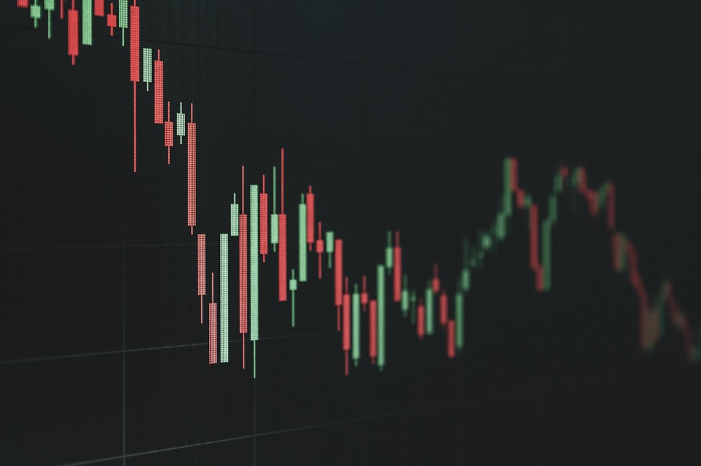

Nhiều người bước chân vào thị trường với giấc mơ nhân đôi tài khoản nhanh chóng. Tuy nhiên, họ chưa bao giờ tự hỏi bản thân sẽ mất bao nhiêu tiền nếu thị trường sụt giảm. Rủi ro luôn song hành cùng lợi nhuận. Vậy rủi ro đầu tư chứng khoán là gì và làm sao để bạn bảo vệ túi tiền trước sóng gió? **[Value Investing](/)** sẽ giải thích chi tiết trong bài viết này.

## Bản chất rủi ro đầu tư chứng khoán là gì?

Rủi ro đầu tư chứng khoán là khả năng số vốn đầu tư thực tế của bạn bị sụt giảm hoặc mất mát so với ban đầu. Điều này xảy ra do thị trường không đi theo đúng những kỳ vọng phân tích của bạn.

Trong tài chính, lợi nhuận luôn tỷ lệ thuận với rủi ro. Những khoản đầu tư có tiềm năng sinh lời cực kỳ cao cũng sẽ ẩn chứa mức độ nguy hiểm tương đương.

Nhiều người thường e sợ rủi ro nên lựa chọn gửi tiết kiệm ngân hàng. Tuy nhiên, việc tránh hoàn toàn rủi ro sẽ khiến tiền của bạn bị mất giá trị do lạm phát.

Do đó, người thông minh không tìm cách trốn tránh rủi ro. Họ học cách chấp nhận và quản lý nó một cách khoa học để tối ưu hóa hiệu quả đầu tư.

Trước khi nghĩ đến lợi nhuận, bạn phải học cách tự hỏi bản thân liệu [có nên đầu tư chứng khoán](/dau-tu/co-phieu/co-nen-dau-tu-chung-khoan-khong/) hay không. Việc thấu hiểu rủi ro giúp bạn chuẩn bị một tâm lý vững vàng trước mọi biến động lớn.

## Ví dụ thực tế đời thường giúp F0 phân biệt các loại rủi ro

Để giúp người mới dễ dàng hình dung, chúng ta hãy xem xét ví dụ thực tế về việc mở một quán ăn tại Việt Nam.

Giả sử bạn quyết định đầu tư vốn mở một quán phở thương hiệu riêng.

**Trường hợp thứ nhất**. Thời tiết thành phố xảy ra bão lớn kèm ngập lụt diện rộng kéo dài nhiều ngày. Không một ai có thể ra đường để đến quán ăn của bạn.

Sự kiện này ảnh hưởng đến toàn bộ các hộ kinh doanh trong khu vực chứ không riêng gì bạn. Đây chính là minh họa cho khái niệm rủi ro hệ thống của thị trường.

**Trường hợp thứ hai**. Nguồn cung cấp thịt bò chính cho quán của bạn bất ngờ tăng giá mạnh. Đồng thời, đầu bếp chính của quán xin nghỉ việc đột xuất mà không báo trước.

Sự cố này chỉ xảy ra riêng tại quán phở của bạn chứ các quán khác vẫn hoạt động bình thường. Đây chính là biểu hiện của rủi ro phi hệ thống.

Bạn có thể chủ động giảm thiểu rủi ro phi hệ thống bằng cách đa dạng hóa thực đơn hoặc tìm nhiều nhà cung cấp dự phòng. Tuy nhiên, bạn không thể tránh được rủi ro hệ thống từ thiên tai thời tiết.

Ví dụ trực quan này cho thấy tầm quan trọng của việc nhận diện từng loại rủi ro. Khi hiểu rõ nguyên nhân, bạn sẽ chủ động thiết lập được các biện pháp phòng vệ phù hợp cho túi tiền của mình.

## 5 loại rủi ro chứng khoán F0 thường gặp nhất tại Việt Nam

Khi thực chiến giao dịch trên sàn HOSE hay HNX, bạn sẽ thường xuyên đối mặt với năm loại rủi ro sau.

**1. Rủi ro biến động thị trường (Market risk)**. Đây là rủi ro xuất phát từ xu hướng chung của toàn bộ nền kinh tế vĩ mô. Thị trường bước vào chu kỳ suy thoái sẽ kéo giá hầu hết các cổ phiếu đi xuống.

**2. Rủi ro lãi suất và lạm phát vĩ mô**. Khi Ngân hàng Nhà nước tăng lãi suất điều hành, dòng tiền sẽ rút khỏi thị trường chứng khoán để quay về ngân hàng. Lạm phát tăng cao cũng làm giảm sức mua và lợi nhuận của các doanh nghiệp.

**3. Rủi ro kinh doanh nội tại của doanh nghiệp**. Doanh nghiệp có thể gặp khó khăn trong việc tiêu thụ sản phẩm hoặc bị đối thủ cạnh tranh cướp mất thị phần. Điều này dẫn đến doanh thu và lợi nhuận sụt giảm mạnh.

**4. Rủi ro thanh khoản (Liquidity risk)**. Đây là rủi ro khi bạn muốn bán cổ phiếu nhưng không có ai đặt lệnh mua đối ứng. Nhóm cổ phiếu penny đầu cơ thường xuyên bị mất thanh khoản hoàn toàn khi thị trường lao dốc.

**5. Rủi ro đòn bẩy tài chính (Margin call)**. Việc lạm dụng công cụ vay ký quỹ margin là con dao hai lưỡi cực kỳ nguy hiểm. Khi giá cổ phiếu giảm sâu, bạn sẽ bị công ty chứng khoán gọi bổ sung tài sản hoặc ép bán giải chấp.

F0 nên hạn chế tối đa việc sử dụng [giao dịch ký quỹ (margin)](/dau-tu/co-phieu/margin-la-gi/) khi chưa tích lũy đủ kinh nghiệm thực chiến. Điều này giúp bảo vệ tài khoản khỏi những cú sập bất ngờ.

Thực tế cho thấy, nhiều F0 thường bỏ qua các rủi ro vĩ mô và chỉ tập trung vào việc tìm kiếm các siêu cổ phiếu. Đây là sai lầm nguy hiểm có thể dẫn đến những khoản lỗ nặng nề khi thị trường đổi chiều đột ngột. Hãy luôn ghi nhớ rằng việc nhận diện rủi ro là bước đi bắt buộc trước khi đưa ra bất kỳ quyết định đầu tư nào.

*Ảnh: Torsten Dederichs / Unsplash*

## 3 chiến lược quản trị rủi ro thực chiến cho F0

Kiểm soát rủi ro là yếu tố sống còn quyết định sự thành bại lâu dài của bạn trên thị trường chứng khoán.

**1. Tuyệt đối tuân thủ quy tắc đa dạng hóa danh mục đầu tư**. Bạn không nên dồn hết vốn liếng vào một cổ phiếu duy nhất. Hãy chia nhỏ nguồn vốn vào từ 3 đến 5 mã thuộc các ngành nghề khác nhau.

Bạn hãy học [cách chọn cổ phiếu tốt](/dau-tu/co-phieu/cach-chon-co-phieu-tot/) và phân bổ chúng một cách khoa lý. Việc đa dạng hóa giúp giảm thiểu tối đa tác động tiêu cực của rủi ro phi hệ thống.

**2. Thiết lập quy tắc cắt lỗ tự động và có kỷ luật**. Hãy tự đặt ra giới hạn chịu đựng tối đa cho mỗi thương vụ mua, thông thường là 7%. Khi thị giá chạm ngưỡng này, hãy dứt khoát bán ra để bảo vệ vốn.

**3. Chỉ đầu tư bằng nguồn tiền nhàn rỗi dài hạn (không dùng tiền đi vay)**. Áp lực trả lãi vay sẽ phá hỏng mọi quyết định đầu tư sáng suốt của bạn. Việc sử dụng tiền nhàn rỗi giúp bạn điềm tĩnh vượt qua các chu kỳ biến động ngắn hạn.

Nếu bạn không tuân thủ kỷ luật cắt lỗ, rủi ro cháy tài khoản sẽ luôn thường trực. Hãy coi việc cắt lỗ như một chi phí bảo hiểm cần thiết để bảo vệ sự an toàn cho toàn bộ danh mục đầu tư.

*Ảnh: Sasun Bughdaryan / Unsplash*

Kiểm soát rủi ro tốt là chìa khóa vàng giúp bạn tồn tại lâu dài trên thị trường chứng khoán. Hãy bắt đầu xây dựng thói quen quản trị rủi ro nghiêm túc ngay hôm nay.
