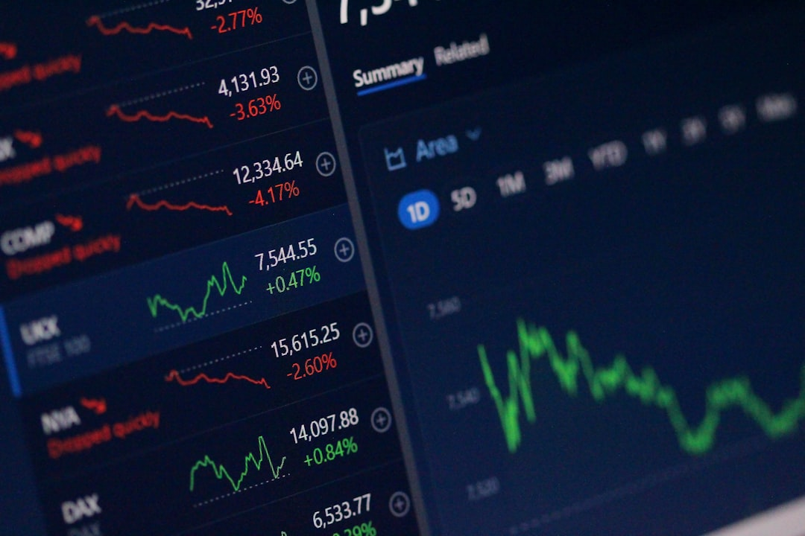
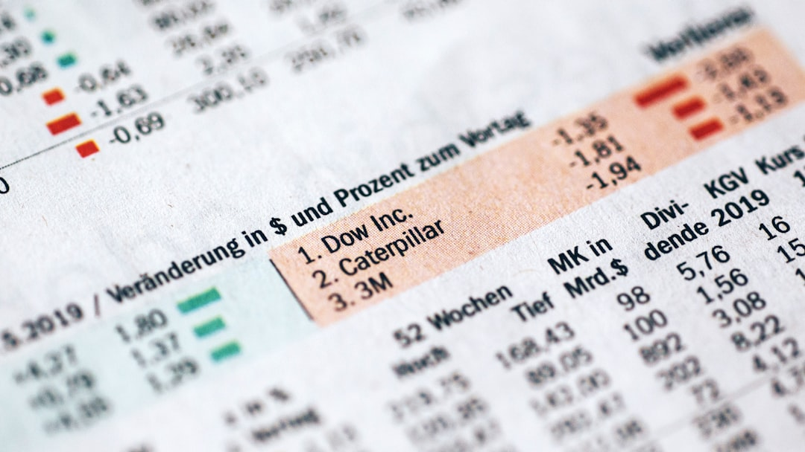

Mở bảng điện ra thấy cổ phiếu A giá 15.000 VNĐ, cổ phiếu B giá 150.000 VNĐ. Có phải cổ phiếu A rẻ hơn cổ phiếu B? Thị giá cổ phiếu là con số nhảy múa hàng ngày trên sàn chứng khoán, nhưng rất nhiều F0 nhầm lẫn giữa thị giá và giá trị thực sự của doanh nghiệp. **[Value Investing](/)** sẽ giúp bạn hiểu đúng bản chất thị giá.

## Thị giá cổ phiếu là gì?

Thị giá cổ phiếu (Market Price) là mức giá mua bán thực tế của một cổ phiếu được xác lập thông qua cơ chế khớp lệnh trên sàn giao dịch chứng khoán tại một thời điểm nhất định.

Khi lệnh đặt mua cao nhất từ nhà đầu tư trùng khớp với lệnh đặt bán thấp nhất từ người sở hữu, giao dịch sẽ thành công và mức giá đó trở thành thị giá hiện hành của cổ phiếu trên bảng điện tử.

Khác với mệnh giá cố định, thị giá cổ phiếu thay đổi liên tục từng giây trong giờ giao dịch chính thức của các sàn HOSE, HNX và UPCoM.

*Ảnh: Anne Nygård / Unsplash*

## 4 Yếu tố quyết định sự biến động của thị giá cổ phiếu

Thị giá cổ phiếu không tự nhiên tăng hay giảm mà phụ thuộc vào 4 động lực chính:

### 1. Quy luật Cung - Cầu trên thị trường

Đây là yếu tố trực tiếp nhất. Nếu số lượng người muốn mua cổ phiếu nhiều hơn số người muốn bán (cầu vượt cung), thị giá sẽ bị đẩy lên cao. Ngược lại, nếu áp lực bán tháo áp đảo lượng người mua (cung vượt cầu), thị giá sẽ hạ xuống.

### 2. Nội lực và kết quả kinh doanh của doanh nghiệp

Về dài hạn, thị giá cổ phiếu luôn phản ánh sức khỏe tài chính của công ty. Doanh nghiệp có doanh thu tăng trưởng, lợi nhuận sau thuế dồi dào và trả cổ tức đều đặn sẽ thu hút dòng tiền, làm thị giá tăng bền vững.

### 3. Yếu tố Kinh tế Vĩ mô và Ngành

Lãi suất ngân hàng, tỷ giá hối đoái, lạm phát và các chính sách kinh tế của Chính phủ tác động mạnh đến chi phí vốn của doanh nghiệp. Khi lãi suất giảm, dòng tiền có xu hướng chảy từ tiết kiệm sang chứng khoán, đẩy thị giá toàn thị trường lên.

### 4. Tâm lý thị trường và Tin đồn

Trong ngắn hạn, cảm xúc của đám đông (nỗi sợ hãi và lòng tham) có thể khiến thị giá lệch xa khỏi giá trị thực. Tin đồn thất thiệt hoặc các sự kiện thiên tai, dịch bệnh cũng tạo ra các cú sốc giá trong ngắn hạn.

## Phân biệt Mệnh giá, Thị giá và Giá trị sổ sách (BVPS)

Rất nhiều nhà đầu tư F0 bị nhầm lẫn giữa 3 khái niệm tài chính căn bản này:

| Tiêu chí | Mệnh giá | Thị giá | Giá trị sổ sách (BVPS) |
| :--- | :--- | :--- | :--- |
| **Định nghĩa** | Giá trị quy ước của cổ phiếu khi phát hành | Giá giao dịch thực tế trên sàn | Giá trị tài sản ròng trên mỗi cổ phiếu |
| **Con số áp dụng** | Mặc định 10.000 VNĐ/cp (tại VN) | Biến động liên tục theo phiên | Cập nhật theo từng kỳ BCTC |
| **Vai trò** | Dùng làm cơ sở tính [vốn hóa thị trường](/dau-tu/co-phieu/von-hoa-thi-truong-la-gi/) ban đầu | Phản ánh tâm lý & kỳ vọng thị trường | Dùng để tính [chỉ số P/B](/phan-tich/co-ban/pb-la-gi/) |

*Ảnh: Infrarate.com / Unsplash*

## Sai lầm phổ biến của F0 khi nhìn vào thị giá cổ phiếu

Sai lầm lớn nhất của người mới tham gia thị trường là đánh giá đắt hay rẻ dựa trên con số thị giá tuyệt đối.

Ví dụ: 
* Cổ phiếu X có thị giá **10.000 VNĐ**, nhưng lợi nhuận tạo ra trên mỗi cổ phiếu (EPS) chỉ là 100 VNĐ -> Chỉ số P/E = 100 lần (rất đắt).
* Cổ phiếu Y có thị giá **100.000 VNĐ**, nhưng EPS đạt tới 20.000 VNĐ -> Chỉ số P/E = 5 lần (rất rẻ).

Như nhà đầu tư huyền thoại Warren Buffett từng nói: *"Price is what you pay. Value is what you get"* (Giá cả là thứ bạn trả, Giá trị là thứ bạn nhận được).

Đầu tư giá trị thành công là việc bạn tìm kiếm những cổ phiếu có thị giá hiện tại thấp hơn nhiều so với [giá trị nội tại](/phan-tich/co-ban/gia-tri-noi-tai-cua-co-phieu/) của doanh nghiệp đó.
