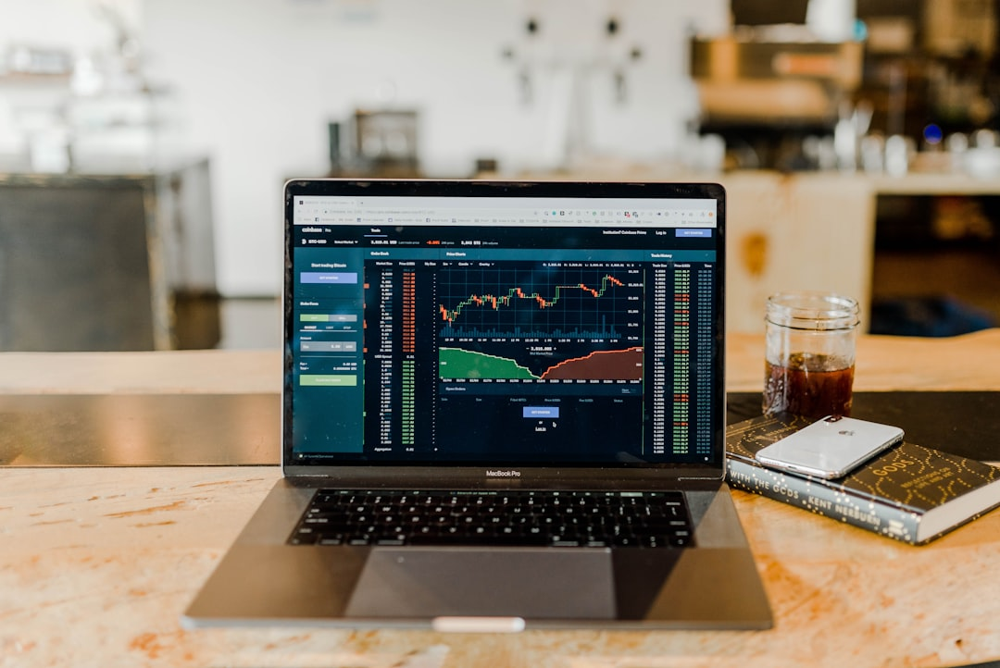

Khi tìm kiếm sàn chứng khoán để giao dịch, hai cái tên đứng đầu bảng xếp hạng thị phần và quy mô là VPS và SSI luôn khiến nhà đầu tư băn khoăn. Bài viết **so sanh vps va ssi** từ **[Value Investing](/)** sẽ làm rõ sự khác biệt giữa hai gã khổng lồ này về biểu phí, margin, độ ổn định ứng dụng và dịch vụ môi giới.

## Hai thế lực lớn nhất thị trường chứng khoán Việt Nam

Thị trường chứng khoán Việt Nam ghi nhận sự cạnh tranh gay gắt giữa nhiều công ty môi giới khác nhau. Tuy nhiên, VPS và SSI luôn đứng ở những vị trí cao nhất về quy mô khách hàng và giá trị giao dịch. Mỗi bên sở hữu những thế mạnh riêng biệt tạo nên sức hút đối với từng nhóm đối tượng cụ thể.

VPS đi lên từ chiến lược mở rộng quy mô môi giới cá nhân vô cùng nhanh chóng và hiệu quả. Họ tập trung vào các nhà đầu tư nhỏ lẻ bằng dịch vụ hỗ trợ tận tình từ đội ngũ chăm sóc. SSI lại duy trì sự phát triển vững chắc bằng cách cung cấp dịch vụ tiêu chuẩn cho khách hàng lớn. Cả hai đều thuộc nhóm **[chọn công ty chứng khoán](/reviews/review-cong-ty-chung-khoan-cho-nguoi-moi/)** hàng đầu hiện nay.

Sự khác biệt này bắt nguồn từ định hướng phát triển chiến lược lâu dài của ban lãnh đạo hai bên. VPS mong muốn phủ rộng sự hiện diện đến mọi ngóc ngách của thị trường tài chính cá nhân. SSI chọn cách khẳng định uy tín và chất lượng dịch vụ tư vấn đầu tư chuyên nghiệp cốt lõi.

Hiểu được đặc điểm của từng công ty sẽ giúp bạn tránh được những lãng phí không đáng có. Nó cũng giúp bạn thiết lập một lộ trình giao dịch phù hợp với khả năng tài chính của mình. Hãy cùng đối chiếu chi tiết để đưa ra lựa chọn sáng suốt nhất cho bản thân.

## Phân tích các tiêu chí so sánh thực tế

Dưới đây là đối chiếu chi tiết về 5 tiêu chuẩn thực tế giúp bạn dễ dàng đánh giá lựa chọn.

### 1. Phí giao dịch và lãi suất cho vay Margin

Chi phí vận hành tài khoản luôn là yếu tố ảnh hưởng trực tiếp đến lợi nhuận ròng của bạn. VPS áp dụng biểu phí giao dịch từ 0.15% sau khi kết thúc thời gian miễn phí cho tài khoản mới. Mức phí này tương đối cạnh tranh nếu so sánh với mặt bằng chung các công ty truyền thống.

SSI áp dụng mức phí giao dịch dao động từ 0.15% đến 0.25% tùy thuộc vào giá trị giao dịch. Với những nhà đầu tư ngắn hạn trading liên tục, mức phí này sẽ bào mòn lợi nhuận nhanh chóng. Về khía cạnh lãi vay margin, VPS áp dụng mức lãi suất thông thường khoảng 10.5%/năm.

Con số này tại SSI là khoảng 11.5%/năm, cao hơn một chút so với đối thủ của mình. Nếu bạn thường xuyên sử dụng đòn bẩy ký quỹ, VPS sẽ giúp bạn tiết kiệm chi phí vay đáng kể. Tuy nhiên, cả hai bên đều thường xuyên có các gói lãi suất ưu đãi cho khách hàng lớn.

### 2. Chất lượng đội ngũ môi giới tư vấn

Nếu bạn là người mới cần sự đồng hành, đội ngũ môi giới sẽ là yếu tố quyết định. VPS nổi tiếng với số lượng môi giới đông đảo nhất thị trường chứng khoán Việt Nam hiện nay. Mạng lưới hỗ trợ này giúp khách hàng dễ dàng tiếp cận thông tin. Bạn có thể xem chi tiết trong bài **[đánh giá VPS](/reviews/review-vps-securities/)** để hiểu rõ hơn.

Tuy nhiên, do tuyển dụng ồ ạt nên chất lượng môi giới của VPS không được đồng đều. Nhiều F0 phản ánh gặp phải môi giới trẻ tuổi thiếu kinh nghiệm thực chiến trên thị trường. Trong khi đó, SSI sở hữu đội ngũ tư vấn được chọn lọc và đào tạo rất bài bản.

Môi giới của SSI thường có chứng chỉ hành nghề chuyên nghiệp và thâm niên hoạt động lâu năm. Họ hỗ trợ khách hàng xây dựng danh mục đầu tư dựa trên các phân tích khoa học và thực tế. Mô hình này giúp nhà đầu tư yên tâm hơn khi đưa ra các quyết định phân bổ vốn lớn.

### 3. Giao diện và độ mượt ứng dụng (SmartOne vs iSSI)

Trải nghiệm giao dịch số hóa ngày nay là tiêu chí quan trọng để đánh giá chất lượng sàn. Ứng dụng SmartOne của VPS sở hữu giao diện trẻ trung, trực quan và tích hợp nhiều tiện ích. SmartOne tối ưu hóa tốt cho các thao tác đặt lệnh cổ phiếu và phái sinh nhanh chóng.

Ứng dụng iSSI của SSI lại mang phong cách tối giản, chú trọng vào tính năng bảo mật thông tin. iSSI cung cấp hệ thống cập nhật tin tức thị trường và danh mục khuyến nghị trực quan cho khách. Tuy nhiên, giao diện của iSSI đôi lúc bị đánh giá là hơi cổ điển và ít cập nhật tính năng mới.

*Ảnh: Austin Distel / Unsplash*

SmartOne lại nhận được nhiều phản hồi tích cực từ thế hệ nhà đầu tư trẻ tuổi năng động. Nền tảng này giúp họ theo dõi danh mục tài sản một cách thuận tiện nhất trên di động. Khả năng đồng bộ hóa dữ liệu nhanh giúp nâng cao hiệu quả theo dõi thị trường hàng ngày.

### 4. Độ ổn định hệ thống trong phiên biến động mạnh

Đây chính là khía cạnh mà SSI thể hiện ưu thế vượt trội so với đối thủ của mình. Hệ thống giao dịch của SSI nổi tiếng là ổn định và có khả năng chịu tải cực kỳ tốt. Rất hiếm khi khách hàng gặp phải sự cố nghẽn lệnh hay không thể đăng nhập vào iSSI.

Ngược lại, VPS thỉnh thoảng bị phản ánh về tình trạng gián đoạn kết nối vào giờ cao điểm. Khi thị trường xảy ra hoảng loạn hoặc hưng phấn tột độ, SmartOne đôi lúc phản hồi chậm. Điều này có thể khiến nhà đầu tư ngắn hạn bỏ lỡ các thời điểm cắt lỗ quan trọng.

Sự ổn định hệ thống là yếu tố quyết định giúp bảo vệ tài sản của nhà đầu tư. Nhiều người sẵn sàng trả mức phí cao tại SSI để đổi lấy sự yên tâm tuyệt đối này. Một lệnh bị nghẽn có thể gây thiệt hại lớn hơn nhiều so với phần chênh lệch phí giao dịch.

### 5. Chất lượng báo cáo phân tích doanh nghiệp

Trung tâm phân tích SSI Research là điểm tựa vững chắc cho các nhà đầu tư giá trị. Các báo cáo phân tích doanh nghiệp và ngành tại đây luôn có chất lượng chuyên môn rất cao. SSI cung cấp các góc nhìn vĩ mô khách quan dựa trên những nguồn số liệu uy tín. Bạn có thể tham khảo thêm bài **[đánh giá SSI](/reviews/review-ssi-securities/)** để biết cách nhận các báo cáo này.

VPS cũng có bộ phận phân tích nhưng các báo cáo thường tập trung vào khuyến nghị ngắn hạn. Họ hướng tới việc cung cấp các ý tưởng giao dịch nhanh chóng theo dòng tiền của thị trường. Mức độ chuyên sâu của các báo cáo tại VPS chưa thể sánh ngang với SSI Research.

Đối với nhà đầu tư thích tự nghiên cứu lâu dài, tài nguyên của SSI là công cụ quý giá. Bạn sẽ nhận được các phân tích chi tiết giúp định hình chiến lược đầu tư bài bản nhất. Các tài liệu này được gửi trực tiếp đến hộp thư điện tử của khách hàng định kỳ.

## Nên chọn VPS hay SSI cho hành trình của bạn?

Lựa chọn giữa hai ông lớn này phụ thuộc vào phong cách giao dịch của bạn. VPS là điểm xuất phát phù hợp cho các F0 muốn có người đồng hành sát sao trực tiếp. Dịch vụ môi giới năng động của VPS sẽ giúp bạn làm quen nhanh với nhịp đập thị trường. Tuy nhiên, bạn cần chú ý kiểm soát chi phí giao dịch khi tài khoản phát sinh nhiều lệnh.

SSI là bến đỗ lý tưởng cho những nhà đầu tư có quy mô vốn lớn và thích đầu tư giá trị. Sự an tâm về hệ thống và chất lượng báo cáo phân tích là những điểm cộng không thể bỏ qua. Tại đây, bạn sẽ được tiếp cận môi trường đầu tư chuẩn mực và có tính chuyên nghiệp cao.

Dù lựa chọn công ty nào, hãy tham khảo **[cách mở tài khoản chứng khoán](/dau-tu/co-phieu/cach-mo-tai-khoan-chung-khoan/)** để bắt đầu quy trình trực tuyến. Việc mở tài khoản online bằng công nghệ eKYC hiện nay diễn ra vô cùng nhanh chóng và tiện lợi. Bạn cũng có thể mở tài khoản thử nghiệm ở cả hai nơi để tự đưa ra so sánh thực tế.

Nhiều nhà đầu tư giàu kinh nghiệm thường duy trì đồng thời tài khoản tại cả hai công ty. Họ dùng VPS để tận dụng các đợt ưu đãi margin ngắn hạn và giao dịch nhanh trên app. SSI sẽ là nơi họ cất giữ tài sản dài hạn và tham khảo các báo cáo chiến lược doanh nghiệp.

---

**Tuyên bố miễn trừ trách nhiệm:** Thông tin trong bài viết được Value Investing tổng hợp từ các nguồn công khai công ty công bố tại thời điểm năm 2026. Bài viết mang tính chất tham khảo khách quan, không chứa khuyến nghị đầu tư hoặc cam kết tài chính nào. Độc giả nên tự kiểm tra lại các mức biểu phí thực tế trước khi đưa ra quyết định mở tài khoản.
